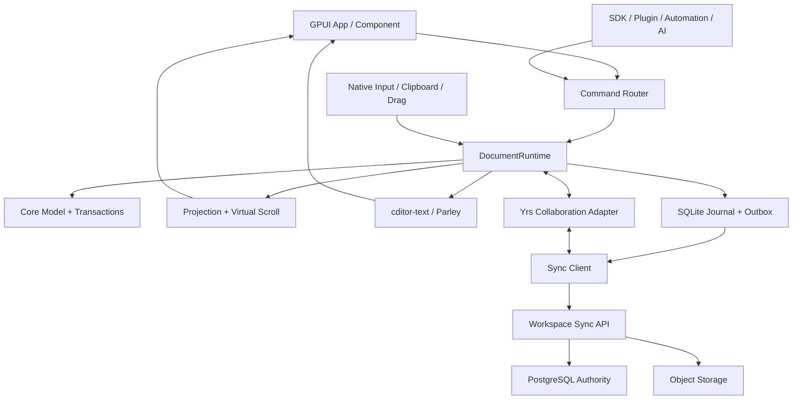
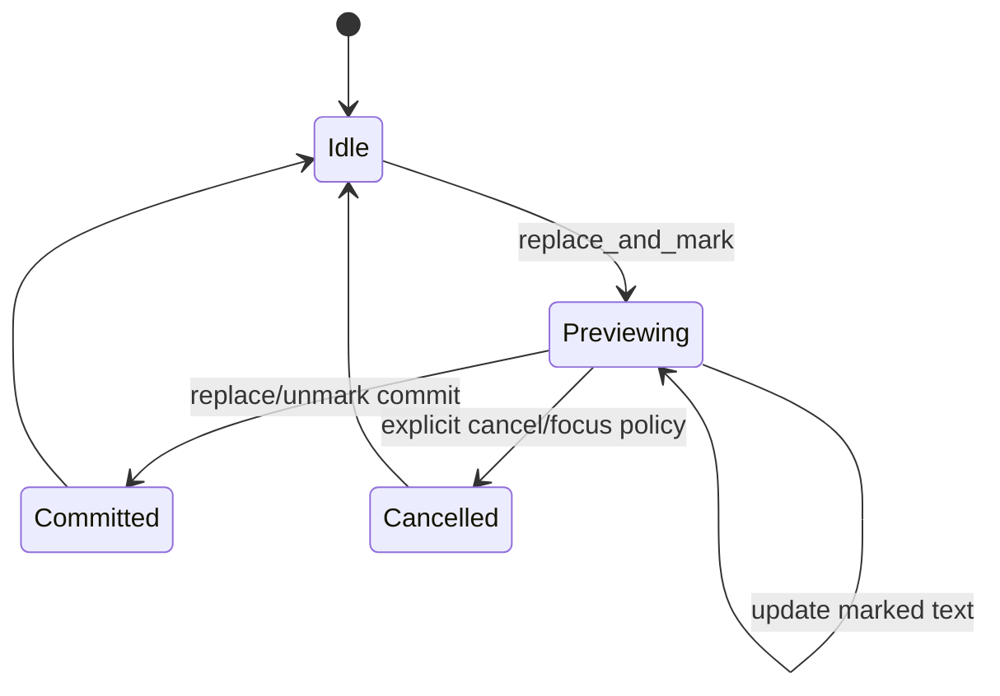
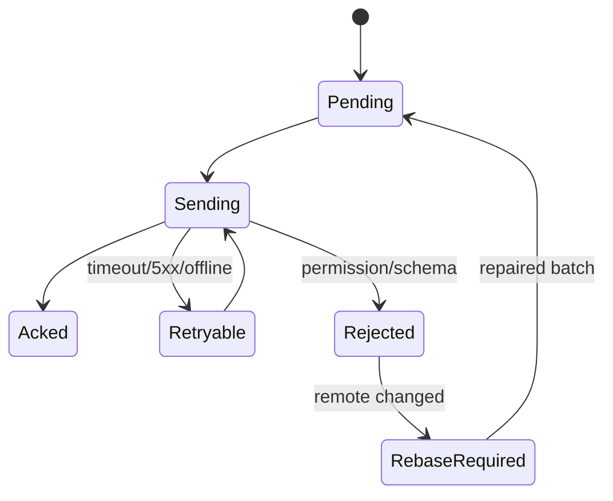

# Cditor 成熟 Notion 类编辑器总体设计与重构总计划

> 文档状态：目标架构（Authoritative Target Architecture）
>
> 创建日期：2026-07-16
>
> 适用范围：Cditor 桌面编辑器、嵌入式组件、离线存储、云同步、实时协作、扩展 SDK
>
> 性能基础：[大文档富文本架构](../large-document-rich-text-architecture.md)
>
> 执行规则：实现每完成一项，必须在本文对应任务前将 `[ ]` 改为 `[x]`，同时补充测试、基准或人工验收证据。
>
> 当前执行范围（2026-07-17）：按产品决策延期 Phase 9/Yrs 多人实时协作；其余阶段继续实施。延期项保持未勾选，不计作已完成。

---

## 0. 文档使命

本文不是 Parley 迁移说明，也不是当前代码的注释版目录。它定义 Cditor 从“具备大文档骨架的富文本编辑器”重构为“成熟、可靠、可扩展、可协作的 Notion 类知识工作平台”时的唯一目标架构。

本文同时回答五个问题：

1. 产品最终要具备什么能力，哪些能力不应混为一谈。
2. 每一类状态由谁持有，谁可以修改，谁只能消费投影。
3. 文本、Block、表格、数据库视图、白板、同步和协作如何共享一套事务与版本协议。
4. 当前代码如何迁移，哪些部分可以保留，哪些部分必须替换或隔离。
5. 如何用阶段 Gate、自动化测试、基准和人工验收判断重构是否真的完成。

文档优先级：

```text
本文：产品与目标系统总架构
  > large-document-rich-text-architecture.md：大文档性能与虚拟化基础
  > 专题 architecture / plans / acceptance：子系统细化与验收记录
  > archive：历史经验与失败证据，不代表当前事实
```

发生冲突时必须按上述优先级处理，并在本文增加 ADR，而不是让两个实现同时存在。

---

## 1. 文档审计范围与事实分级

### 1.1 已审阅资料

本设计综合了 `doc/` 下全部资料：

- 大文档架构、实现状态和任务清单。
- GUI、数据库、SQLite/PostgreSQL 双后端、远程 PostgreSQL、组件 SDK 架构。
- Parley 迁移、编辑器重设计和 0.11 能力审计。
- 当前编辑问题、高性能任务、表格运行时、表格交互、横向滚动和表格验收。
- Markdown、IME、列表、Block chrome、gutter 拖拽、V1 操作迁移记录。
- 白板集成、骨架屏、工程目录和历史模块拆分记录。
- Notion 表格 HTML 原型。

### 1.2 事实可信度

任务状态不得只看旧文档中的复选框。判断顺序固定为：

1. 当前代码和当前测试。
2. 当前实现状态文档。
3. 当前自动化与人工验收记录。
4. 历史任务清单和迁移对话。

| 状态 | 含义 |
|---|---|
| 已实现 | 当前代码存在，关键自动化测试通过 |
| 已集成 | 已实现并进入真实 UI、持久化、恢复链路 |
| 已验收 | 自动化、基准和要求的人工矩阵全部通过 |
| 部分完成 | 只有模型、局部路径或自动化的一部分 |
| 目标设计 | 本文定义但尚未实现 |
| 历史证据 | 仅用于解释选择，不表示当前能力 |

### 1.3 当前基线判断

当前 Cditor 已经拥有可保留的大文档骨架：

- `DocumentRuntime`、结构索引、可见索引、全局虚拟滚动和窗口投影。
- 当前编辑 Block pin、payload window、布局高度索引和异步版本拒绝。
- 文本/结构编辑、局部 undo/redo、Markdown 粘贴、表格运行时和多类 Block。
- GPUI 输入桥、IME 基础、Parley 0.11 布局接入和字体能力审计。
- PostgreSQL、SQLite 存储 crate 和组件 API 的初步边界。

但“已有类型或测试”不等于成熟产品。当前仍缺：

- 本地可靠日志、离线编辑、同步恢复和服务端 API 的统一协议。
- 多人协作、权限、分享、评论、历史、垃圾箱和审计。
- Notion 数据库式集合、属性、视图、过滤、公式、关联和汇总。
- 完整 IME 平台矩阵、无障碍、国际化和真实 GUI 验收。
- 插件沙箱、数据迁移、兼容策略、遥测、崩溃恢复和发布 Gate。

---

## 2. 冲突裁决与不可逆决策

### 2.1 冲突矩阵

| 冲突 | 历史方案 | 本文裁决 | 原因 |
|---|---|---|---|
| 客户端持久化 | 客户端直接连接 PostgreSQL | SQLite 本地事务日志 + 同步 API + 服务端 PostgreSQL | 离线可写且不暴露数据库凭据 |
| 数据真相 | PostgreSQL 或 UI entity 是当前真相 | Runtime 是会话真相；SQLite 是本地可靠真相；服务端是团队权威 | 不同生命周期需要不同权威 |
| 双后端 | SQLite/PostgreSQL 同时写 | 原子本地事务 + outbox；远端 ack/pull | 避免部分成功和顺序反转 |
| 文本布局 | GPUI text API 与 fallback 混用 | `cditor-text` 统一封装 Parley | 所有文本几何必须一致 |
| IME | Parley 或第三方 crate 提供 | 平台/GPUI 提供事件；Runtime 持有 composition；Parley 提供几何 | IME 是操作系统协议 |
| 表格单元格 | 独立 UI entity 或直接改 payload | `TableRuntime` 是 live truth；cell 复用 TextSurface | 避免重复编辑器和实体爆炸 |
| 协作 | CRDT 暂不考虑 | 成熟目标采用 Yrs/Yjs 兼容 CRDT | 需要离线并发和多人编辑 |
| ID | 全局使用 `u64` | 持久化/同步采用 UUIDv7 或 ULID；`u64` 仅作运行时句柄 | 离线创建不能依赖中央自增 |
| 完成状态 | 历史 checkbox 代表完成 | Gate + 代码 + 测试 + 基准 + 人工验收共同决定 | 模型测试不等于产品完成 |
| 未知数据 | 反序列化失败或降级 | 未知 kind、字段、mark、插件 payload 必须无损 round-trip | 升降级和插件缺失不能毁文档 |

### 2.2 ADR-001：Runtime 是编辑会话真相

所有用户编辑先提交给 `DocumentRuntime`。UI、文本布局、SQLite worker、同步 worker、搜索索引和插件只能发送命令、消费不可变 snapshot/event/transaction、提交带完整版本身份的异步结果。它们不能绕过 Runtime 改写当前文档。

### 2.3 ADR-002：采用 Local-First

```text
User Command
  -> Runtime Transaction
  -> SQLite atomic commit(document state + operation + outbox)
  -> UI reports LocallySaved
  -> Sync worker pushes authenticated batch
  -> Server validates permission and ordering
  -> PostgreSQL commits authoritative log/materialized state
  -> Server ack + remote deltas
  -> SQLite records ack/checkpoint
```

PostgreSQL 直连仅保留给开发工具、迁移程序和受控服务端，不进入生产客户端 API。

### 2.4 ADR-003：Yrs 是协作引擎，Cditor Operation 是产品语义

选择 Yrs：Rust 原生、可与 Yjs 互通，已有 state vector、增量 update、awareness 和相对位置。

- Cditor Command/Transaction 表达产品意图、权限和 undo 单元。
- Yrs update 表达可合并共享状态。
- 两者通过 `CollabAdapter` 映射，Yrs map key 不得渗透到 GUI。
- 非协作模式使用同一 Command/Transaction，不维护第二套编辑代码。

### 2.5 ADR-004：文本布局统一进入 cditor-text

`cditor-text` 是 Parley 的唯一直接消费者，负责 shaping、字体 fallback、Bidi、line breaking、glyph run、cluster、caret、selection、hit-test 和 range bounds。Runtime 不依赖 GPUI，`cditor-text` 也不持有文档事务。

### 2.6 ADR-005：简单表格与数据库集合分离

- Simple Table：文档内排版表格，强调单元格文本和行列操作。
- Collection/Database：结构化记录集合，强调 schema、property、view、filter、sort、relation、formula。

二者可以显式转换，但不得用一个不断膨胀的 `TablePayload` 同时承担两类语义。

---

## 3. 成熟产品定义

### 3.1 核心用户旅程

Cditor 达到“成熟 Notion 类编辑器”至少要支持：

1. 无网络时创建 workspace、page、Block、表格和附件，重启后内容仍在。
2. 网络恢复后自动同步；多设备和多人编辑合并，冲突可解释且不丢数据。
3. 100,000 个 Block 的文档不全量 hydrate 或 realization。
4. 中文、日文、韩文、emoji、组合字符、RTL/Bidi 和混合字体输入正确。
5. Block 可拖动、嵌套、折叠、变换、复制、链接、评论和恢复历史版本。
6. 表格和数据库视图具备稳定行列 ID、键盘操作、排序过滤、关联和虚拟化。
7. Markdown/HTML/原生剪贴板导入导出可预测；未知内容不丢失。
8. 插件和宿主可注册命令、Block、菜单、导入导出器，但不能破坏文档安全。
9. 权限、分享、审计、垃圾箱、搜索和备份形成完整工作区闭环。
10. 崩溃、断电、同步失败、插件缺失和版本降级都能恢复或只读打开。

### 3.2 产品层级

| 层级 | 目标 |
|---|---|
| Editor Core | 文本、Block、selection、command、transaction、undo |
| Document System | page tree、引用、附件、评论、历史、搜索 |
| Structured Data | simple table、collection、property、view、formula |
| Local-First | SQLite journal、outbox、恢复、离线状态 |
| Collaboration | CRDT、presence、remote cursor、并发冲突 |
| Workspace | 用户、角色、权限、分享、审计、垃圾箱 |
| Platform | SDK、插件、AI、导入导出、宿主集成 |

### 3.3 明确非目标

第一轮重构不建设浏览器 DOM 编辑器，不自研 shaping/Bidi/CRDT，不在文档 Runtime 内运行白板逐帧模型，不允许生产客户端直连 PostgreSQL，不以 Markdown source 为原生真相，也不用全量 UI entity 或全量 Parley layout 表示大文档。

---

## 4. 总体架构与状态所有权



### 4.1 真相所有权

| 状态 | 唯一真相 | UI 权限 | 持久化 |
|---|---|---|---|
| 当前会话文档 | `DocumentRuntime` | 只能发 command | SQLite + server |
| 完整结构 | `DocumentIndex` | 只读投影 | 是 |
| 当前可见顺序 | `VisibleDocumentIndex` | 只读投影 | 可重建 |
| Block 高度 | `BlockHeightIndex/PageLayoutIndex` | 只能提交测量 | cache |
| 全局滚动 | `VirtualScrollState` | 发 scroll intent | 会话态 |
| 文档选区 | `DocumentSelection` | 发 selection intent | presence/会话态 |
| 输入/IME | `EditingSession` | native adapter 调 API | commit 前不落盘 |
| 文本布局 | `TextLayoutSnapshot` | 只读绘制 | cache |
| 表格 live state | `TableRuntime` | 发 table command | payload/ops |
| 集合查询 | `CollectionRuntime` | 发 view command | schema/view |
| hover/menu/drag preview | App transient | 可修改 | 否 |
| 本地可靠状态 | SQLite transaction log | 否 | 本地磁盘 |
| 团队共享权威 | Server/PostgreSQL | 否 | 服务端 |
| 协作合并状态 | Yrs doc/state vector | 否 | update/checkpoint |
| 白板交互中场景 | cditor-whiteboard local scene | 独立编辑器修改 | commit snapshot |

### 4.2 Runtime 内部分域

```text
DocumentRuntime
├── StructureRuntime
│   ├── DocumentIndex / VisibleDocumentIndex
│   └── BlockCapabilityRegistry
├── ContentRuntime
│   ├── PayloadWindow / PayloadCache
│   ├── TextSurfaceRegistry
│   ├── TableRuntimeRegistry
│   └── CollectionRuntimeRegistry
├── EditingRuntime
│   ├── EditingSession / IME / DocumentSelection
│   ├── CommandDispatcher / TransactionEngine
│   └── UndoManager
├── LayoutRuntime
│   ├── BlockHeightIndex / PageLayoutIndex
│   ├── TextLayoutCache
│   └── LayoutScheduler
├── ViewRuntime
│   ├── VirtualScrollState / WindowPlanner
│   └── ProjectionBuilder
└── IntegrationRuntime
    ├── LocalPersistencePort / SyncPort
    ├── SearchIndexPort / AssetPort
    └── PluginPort
```

### 4.3 依赖方向

```text
cditor-desktop / cditor-sdk
  -> cditor-runtime
  -> cditor-text
  -> cditor-core

cditor-sync / cditor-collab
  -> cditor-core
  -> cditor-store

cditor-store-sqlite / cditor-store-postgres
  -> cditor-store
  -> cditor-core
```

GPUI 只能出现在 app/adapter；Parley 只能由 `cditor-text` 直接依赖；SQLx 只能出现在具体 store/server 实现。

---

## 5. 目标工程结构

```text
crates/
├── core                 # ID、文档模型、operation、transaction、schema
├── text                 # Parley、font bridge、layout snapshot、geometry
├── runtime              # 会话真相、编辑、投影、调度、虚拟化
├── editor               # command、keymap、clipboard policy
├── store                # 存储 port、DTO、migration contract
├── store-sqlite         # 本地日志、materialized state、FTS、outbox
├── store-postgres       # 服务端 repository；客户端模式逐步退役
├── sync                 # protocol/client、batch、retry、checkpoint
├── collab               # Yrs adapter、awareness、relative positions
├── sdk                  # 稳定 API、plugin contracts
├── ai                   # provider、context、preview/apply policy
├── cditor-whiteboard    # 独立白板引擎
└── app                  # GPUI shell、native adapters、render/overlay

server/
├── api                  # auth/workspace/document/sync/share
├── worker               # search、asset、preview、compaction、export
└── migrations           # PostgreSQL authoritative schema
```

工程约束：

- 非白板 Rust 文件超过 700 行必须拆分。
- Runtime 按 editing/content/layout/projection/integration 分域。
- 公共类型与实现分离；`mod.rs` 只声明模块和受控 re-export。
- 稳定 API 仅包括 builder/component/handle、command/outcome/event、snapshot、selection、import/export report 和 provider/extension contract。
- GPUI entity、Parley layout object、Runtime 内部字段和 SQL row DTO 不属于稳定 API。

---

## 6. 标识、版本与兼容模型

### 6.1 ID 与顺序键

持久化 ID 包括 Workspace、Document、Block、Surface、Row、Column、Collection、Property、View、Operation、Actor、Device 和 Asset。统一使用 UUIDv7 或 ULID 128 位，必须允许客户端离线生成。

Runtime 可用 `RuntimeHandle(u64)` 和双向 arena 保持紧凑访问；当前 `u64` ID 通过迁移表映射，新网络协议禁止依赖进程自增整数。

Block sibling 顺序使用可比较的 fractional order key：

- 常规插入不重排全部 sibling。
- 支持并发插入和局部 rebalance。
- rebalance 不改变 BlockId、selection、comment anchor 或 backlink。
- Runtime 仍维护紧凑 preorder index，不在每帧按字符串 key 排序。

### 6.2 异步版本身份

每个异步结果携带：

```rust
struct SnapshotIdentity {
    document_id: DocumentId,
    structure_version: u64,
    surface_id: Option<SurfaceId>,
    content_version: Option<u64>,
    layout_version: u64,
    font_epoch: u64,
    scale_epoch: u64,
    viewport_epoch: u64,
    generation: u64,
}
```

应用前逐项验证。旧版本的 caret affinity、candidate rect、line layout、thumbnail 和 measured height 都必须拒绝，不能 clamp 到新文本末尾。

### 6.3 Schema 与未知数据

独立维护 document format、block payload、operation、clipboard、plugin manifest、SQLite/PostgreSQL schema 版本。

- reader 接受兼容旧 minor；writer 默认当前版本。
- 破坏性升级先备份、dry-run、校验，再原子切换。
- 降级无法安全写时进入只读兼容模式。
- 未知 Block、mark、property、字段和插件 payload 必须保存 raw envelope。
- 插件缺失时显示安全占位，但 copy/move/sync/native export/save 无损。
- 只有用户明确选择“转换为普通文本”时允许有损降级。

---

## 7. Workspace、Page 与 Block 模型

### 7.1 Workspace 和 Page

Workspace 包含成员、组、角色、page tree、favorites、recent、templates、trash、collections、assets、comments、notifications 和 audit log。

Page 是导航/权限对象，Document 是编辑内容对象。允许普通 page、database item page、template、发布快照和 synced fragment。Page metadata 包含 title/icon/cover/parent/order、trash/published 状态、创建修改者和权限覆盖。

### 7.2 BlockRecord 与 Payload 分离

结构索引仅保存打开、虚拟化和权限判断所需的轻量数据：

```rust
struct BlockRecord {
    id: BlockId,
    document_id: DocumentId,
    parent_id: Option<BlockId>,
    order_key: OrderKey,
    kind: BlockKindId,
    flags: BlockFlags,
    payload_ref: PayloadRef,
    estimated_height: f32,
    content_version: u64,
}
```

大型 payload 不进入全量 `DocumentIndex`。Payload 只因 viewport、selection、search hit、editing pin、clipboard 或后台任务按需加载。

### 7.3 Block 能力注册表

每个 kind 由 descriptor 声明 schema、capabilities、metrics provider、renderer、editor、serializer、migrator 和 security policy。能力至少覆盖：

- text surface、children/container、inline marks、soft enter。
- caption、resize、full width、block/inner selection。
- stable box、内部虚拟化、异步资源。
- export formats、collaboration、permissions。

禁止 GUI 和 Runtime 分别维护不一致的 `match kind` 能力表。

### 7.4 内置 Block

- 文本：Paragraph、Heading 1-6、Quote、Callout、Code、RawMarkdown、HTML、Math、Mermaid。
- 列表：Bulleted、Numbered、Todo、Toggle。
- 结构：Divider、ColumnsGroup、Column、SyncedBlock、Breadcrumb、TableOfContents。
- 数据：SimpleTable、CollectionView、CollectionItem。
- 媒体：Image、Gallery、Video、Audio、File、Attachment。
- 集成：Bookmark、Embed、Whiteboard、MindMap、CustomPluginBlock。
- 语义：FootnoteDefinition、CommentAnchor、Equation、TemplateButton。

### 7.5 Columns 与 Synced Block

Columns 是真实容器树。选择/复制采用稳定文档顺序，视觉方向键采用 geometry；group 高度取列内容最大值；每列有子 height index；拖入拖出生成结构事务。

Synced Block 引用独立 `FragmentId`。引用位置是 Block 外壳，fragment 只有一个逻辑真相；权限取 fragment 与宿主 page 的交集；协作以 fragment 独立分片；删除引用不立即删除 fragment。

---

## 8. TextSurface 统一协议

普通 Block、table cell、caption、database title、评论输入都复用 TextSurface：

```rust
trait TextSurface {
    fn surface_id(&self) -> SurfaceId;
    fn snapshot(&self) -> TextSnapshot;
    fn replace(&mut self, range: TextRange, insert: RichTextDelta) -> EditResult;
    fn marks_at(&self, position: TextPosition) -> MarkSet;
    fn capabilities(&self) -> TextSurfaceCapabilities;
}
```

- TextSurface 是逻辑协议，不是 UI entity。
- 文档 surface 修改必须进入 transaction。
- UTF-8 是存储形式；快照索引映射 UTF-16、grapheme、word、line。
- link、mention、date、user、inline equation 是 atomic inline object。
- piece table/rope 必须支持局部编辑、snapshot 共享、delta/CRDT bridge 和大 code surface。
- Runtime 位置使用 `SurfaceId + byte_offset + affinity`；持久/协作位置使用 CRDT relative position。
- 跨 snapshot 转换必须显式 map 或失败，禁止静默跳尾。

---

## 9. Parley 文本系统

### 9.1 职责边界

```text
GPUI
  = window、native input、focus、pointer、clipboard、scene paint

Parley / cditor-text
  = font resolution、shaping、fallback、Bidi、wrap、glyph、text geometry

DocumentRuntime
  = content、selection、composition、transaction、undo、cross-block semantics
```

Parley 不提供 IME，不持有文档，也不决定 Enter/Backspace 的 Block 语义。`PlainEditor` 可用于测试或独立单行控件，不得成为 DocumentRuntime 的文本真相。

### 9.2 cditor-text API

```rust
trait TextLayoutEngine {
    fn layout(&self, input: TextLayoutInput) -> Arc<TextLayoutSnapshot>;
    fn relayout(&self, previous: &TextLayoutSnapshot, delta: LayoutDelta)
        -> Arc<TextLayoutSnapshot>;
}

struct TextLayoutInput {
    identity: SnapshotIdentity,
    text: TextSnapshot,
    style_runs: Vec<TextStyleRun>,
    inline_objects: Vec<InlineObject>,
    width: f32,
    scale: f32,
    locale: LocaleId,
    direction: DirectionPolicy,
}
```

`TextLayoutSnapshot` 必须包含：

- 行、run、cluster 和 glyph 的不可变绘制数据。
- logical/visual order、Bidi level、writing direction。
- byte/UTF-16/grapheme 到 cluster 的映射。
- 每个 caret stop 的 upstream/downstream geometry。
- selection fragments、range bounds、hit-test acceleration。
- baseline、ascent、descent、line gap、inline object boxes。
- font identity、content/layout/font/scale version。

### 9.3 最大化使用 Parley

必须接入 Parley 已提供的能力：

- Unicode shaping、script itemization、font fallback。
- Bidi visual order 和 cluster-level navigation。
- word/letter spacing、line height、alignment、wrapping。
- variable fonts 和 OpenType variations。
- synthetic bold/italic 与精确字体匹配。
- brush/style run、underline/strikethrough 的几何基础。
- glyph run 遍历、hit testing、caret 和 selection geometry。
- inline boxes 支持 mention、equation、emoji image 等原子对象。

仍由 Cditor 自己提供：

- layout snapshot cache、version validation、调度和跨 Block 导航。
- 标记/选区/IME 的产品状态。
- 绘制批处理、链接交互、拼写波浪线、评论/搜索高亮。
- font asset 生命周期和 GPUI glyph bridge。

### 9.4 精确字体桥

`FontKey` 必须包含：

- font blob digest。
- TTC/OTC face index。
- variation coordinates。
- synthesis flags。
- family/style/weight/stretch。

不能只用 family name 回查 GPUI 字体。绘制 glyph 时必须证明 Parley 选择的 face 与 GPUI/renderer 使用的 face 相同。字体注册、卸载、系统字体变化和 scale factor 变化都会递增 `font_epoch` 或 `scale_epoch` 并使旧 snapshot 失效。

### 9.5 Cache 与调度

Cache key 至少为：

```text
(surface_id, content_version, style_version, width_bucket,
 locale, direction, font_epoch, scale_epoch)
```

- 当前 editing/composition surface 走 realtime lane。
- viewport 可见 surface 走 visible lane。
- overscan、search preview、prefetch 走 background lane。
- 同一 key 请求去重；取消过期任务；结果应用前校验 identity。
- 内存压力按 offscreen -> overscan -> visible non-editing 顺序淘汰。
- 当前 composition、selection endpoint、drag source 和 dirty unsaved surface 必须 pin。

### 9.6 Geometry 一致性

paint、mouse hit-test、direction key、selection、candidate rect 必须读同一个 snapshot。任何 fallback 只能发生在 snapshot 不存在时，并且：

- 先请求同步最小 realtime layout。
- 若仍不可用，保持旧合法位置，不得 focus 到 text end。
- debug build 记录 geometry fallback reason。
- 正式验收要求正常输入路径 fallback rate 接近 0。

---

## 10. IME 与原生输入

### 10.1 完整 IME 的定义

IME 是“平台协议 + Runtime composition 状态 + Parley 几何”，不是一个可以换 crate 完成的功能。完整实现必须覆盖：

- UTF-16/UTF-8 双向 range 转换，不能切入 code point/grapheme 中间。
- explicit range -> marked range -> selected range 的替换优先级。
- preview、update、commit、cancel、unmark 的不同语义。
- inserted text 内相对 selected range。
- marked underline、selection 和单 caret 的无冲突绘制。
- candidate rect、range bounds 和 point-to-index。
- 普通字符统一走 platform input，避免 keydown 双通道。
- table cell、caption、database title 和单行临时输入。

### 10.2 输入目标

```rust
enum InputTarget {
    DocumentText { document_id: DocumentId, surface_id: SurfaceId },
    TableCell { block_id: BlockId, row_id: RowId, column_id: ColumnId },
    Caption { block_id: BlockId, surface_id: SurfaceId },
    AppTextField { control_id: ControlId },
}
```

注册 GPUI input handler 时绑定 `InputTarget + generation`。平台回调先校验当前 focus/session target；旧 handler 只能拒绝，不能 fallback 到当前 focused block。

### 10.3 Composition 状态机



状态保存：

- target、generation、base snapshot identity。
- base replace range、preview text、marked range。
- selected range、selection reversed、relative selected range。
- last valid caret/candidate geometry。

preview 不写持久 payload、不广播协作 update、不创建用户 undo step。commit 产生一个 transaction/undo unit；cancel 恢复 base selection。`unmark_text` 的平台语义必须测试后明确，不得简单等同 cancel。

### 10.4 Focus 与 composition policy

- 同一 surface 点击或滚动保持 composition。
- 切换 surface 前请求平台 commit/cancel，按平台事件结果执行。
- 远端 operation 命中 composition base range 时先通过 relative position rebase；无法安全 rebase 时提交当前 composition 再应用远端 op，并记录诊断。
- composition Block/surface/layout snapshot 必须 pin。
- candidate rect 必须带 composition generation 和 snapshot identity。

### 10.5 IME 验收矩阵

平台至少覆盖 macOS、Windows；Linux 按正式支持的输入协议覆盖。语言/内容覆盖中文拼音、中文双拼、日文、多阶段韩文、emoji、surrogate pair、组合重音、阿拉伯文、希伯来文、混合 Bidi。

场景覆盖中间插入、selection replacement、多次 preview、cancel、unmark、undo、scroll、zoom、font fallback、table cell、caption、slash search、code language field 和远端并发修改。

---

## 11. Selection、导航与输入语义

### 11.1 DocumentSelection

```rust
struct DocumentSelection {
    anchor: DocumentAnchor,
    focus: DocumentAnchor,
    mode: SelectionMode,
    affinity: SelectionAffinity,
}

enum DocumentAnchor {
    Text(TextPosition),
    BlockEdge { block_id: BlockId, edge: BlockEdge },
    Inner(BlockInnerAnchor),
}
```

`BlockInnerAnchor` 支持 table cell、collection cell、media caption、code line 等内部位置。Selection 模型不引用 GPUI entity，不要求 endpoint 在 render window。

### 11.2 选择模式

- collapsed caret。
- 同 surface 文本 range。
- 跨 Block 文本 range。
- Block range / subtree。
- table rectangular range、row、column、whole table。
- collection row/field range。
- atomic inline object 和 media block。

视觉 fragment 只投影当前窗口，完整模型保留。Selection endpoint、anchor 邻域和跨窗口 auto-scroll target 必须 pin 或按需 hydrate。

### 11.3 导航

- Left/Right 按 Parley visual caret stop，处理 Bidi 和 affinity。
- Option/Ctrl 按 Unicode word boundary。
- Up/Down 用 preferred visual x 在 layout snapshot 中找视觉行。
- Home/End 支持 visual line、logical line 和平台习惯。
- Cmd/Ctrl+方向键支持 surface/Block/document boundary。
- 跨 Block 时读取相邻可见 Block capability；atomic block 选中整体。
- columns 中 Up/Down/Left/Right 使用二维视觉几何，selection 序列仍是文档顺序。

### 11.4 鼠标与触控板

- 单击 caret；双击词；三击 logical line/Block，行为按平台验收。
- 拖选跨 Block 和虚拟窗口，边缘 auto-scroll 使用独立 ticker。
- gutter 先进入 action/drag state，超过阈值才提交 reorder。
- drag target 基于 projection geometry，不扫描 UI entity。
- overlay 不参与 block height 和 text hit-test。

---

## 12. Command、Transaction 与 Undo

### 12.1 唯一命令层

键盘、toolbar、slash menu、context menu、SDK、automation、AI apply 都调用同一个 `CommandRouter`。

```rust
trait Command {
    fn id(&self) -> CommandId;
    fn query(&self, ctx: &CommandContext) -> CommandState;
    fn execute(&self, ctx: &mut CommandContext, args: CommandArgs)
        -> Result<CommandOutcome, CommandError>;
}
```

`query` 返回 enabled/checked/mixed/hidden/reason。UI 不自行推断 bold active、是否可 indent 或是否只读。

### 12.2 Transaction pipeline

```text
Intent
 -> command precondition + permission
 -> normalize selection/input target
 -> build semantic operations
 -> apply atomically to Runtime
 -> update versions/index/height dirty/pins
 -> create inverse or undo payload
 -> append local journal/outbox
 -> emit projection/event
 -> schedule persistence/search/layout/sync
```

Operation 至少包括：

- text insert/delete/replace/marks/inline object。
- block insert/delete/move/split/merge/transform/attrs。
- table row/column/cell/merge/resize/reorder。
- collection schema/record/property/view。
- comment/thread、asset attachment、synced fragment。

每个 transaction 有 transaction_id、origin、actor/device、timestamp、affected IDs、base versions、operations、undo metadata 和 sync metadata。

### 12.3 原子性与失败

- precondition 或 permission 失败时不得部分修改。
- Runtime apply 失败回滚内存 mutation。
- SQLite commit 失败时 Runtime 保留 dirty-unpersisted emergency snapshot，UI 明确显示“仅内存，未安全保存”。
- sync 失败不回滚本地成功编辑。
- 外部 plugin/AI operation 先 schema validate、permission check、size limit。

### 12.4 Undo/Redo

Undo 是用户意图栈，不是数据库 rollback：

- typing 按时间、surface、selection continuity 合并。
- IME commit 一个 step；preview 无 step。
- paste/import、Block drag、table action、AI apply 各为独立 step。
- 新本地编辑清空 redo；远端 operation 不清空本地 undo，但会 rebase relative anchors。
- 大操作用 operation inverse、range snapshot 或 SQLite blob，不复制全文。
- undo/redo 本身生成可同步 transaction，协作中只撤销当前 actor 的可撤销本地意图。
- selection before/after 与 scroll anchor 属于 undo UX metadata，不属于共享文档。

### 12.5 Enter、Backspace 与结构规则

行为通过 Block capabilities 和 command policy 定义：

- Paragraph/heading/list 中 Enter 按 caret split；新 kind 由 policy 决定。
- Code/RawMarkdown 默认 soft newline；Cmd/Ctrl+Enter 可结束或新建 Paragraph。
- 空根 list Enter 转 Paragraph；空嵌套 list outdent。
- caret=0 的样式 Block 先转 Paragraph还是 merge，由明确产品规则和可撤销 transaction 决定。
- merge/delete 涉及 subtree 时必须有显式安全策略，禁止静默丢 child。
- Tab 在 text surface、table、collection、list structure 中按当前 mode 分派。

---

## 13. Clipboard、导入与导出

### 13.1 多格式 Clipboard

复制时同时提供：

1. Cditor native versioned envelope：完整 Block、marks、attrs、assets refs、unknown fields。
2. HTML：供富文本外部应用。
3. Markdown：供文本工具。
4. plain text：通用 fallback。

粘贴优先级为可信 native -> sanitized HTML -> Markdown detection -> plain text。外部 native envelope 必须验证 workspace/asset references 和 schema，不能因 MIME 名匹配就信任。

### 13.2 Paste pipeline

- 先捕获目标 selection 和 snapshot identity。
- 大内容后台 parse，支持 progress/cancel。
- parse 结果若目标版本已变化，使用 anchor mapping/rebase；失败则提示重新选择，不能插错位置。
- prefix/suffix 与 imported first/last text block 合并。
- complex/atomic block 后必要时生成 trailing Paragraph。
- 整次 paste 是一个 transaction 和 undo step。
- 初始高度用 estimator，不同步 layout 全部导入内容。

### 13.3 Markdown

Markdown 只是边界格式：

- shortcut 只解析当前 surface 的小范围 marker。
- full import 使用成熟 CommonMark/GFM parser，不手写完整语法。
- 不支持/不确定语法保留为 RawMarkdown/HTML，不丢原文。
- table escaped pipe、nested emphasis、reference link、image、footnote、HTML、math、Mermaid 都有 fixture。
- export 支持 streaming，未知 Block 走 native attachment 或 fenced fallback 并输出 warning report。
- 建立 import -> native -> export 和 native -> export -> import 的语义 roundtrip 测试。

### 13.4 HTML 与文件

- HTML 经过 allowlist sanitizer，移除 script、event handler、危险 URL 和样式。
- 图片/附件先创建 provisional AssetId 和 stable box，异步复制/上传。
- import bundle 使用 manifest + content hashes，防止 zip slip、路径穿越和资源冒充。
- PDF/DOCX 等复杂格式通过独立 importer，不阻塞编辑主线程。

---

## 14. Block 渲染、Chrome 与复杂 Block

### 14.1 Block shell

所有 Block 使用稳定 shell：

```text
absolute block layer (height from Runtime)
└── full-width interaction root
    └── indent/container wrapper
        └── row
            ├── fixed gutter slot
            └── content surface
                ├── prefix slot
                ├── content renderer
                └── optional caption
```

- hover、focus、action、drag overlay 不改变 outer height。
- prefix/list ordinal 来自 Runtime projection。
- content padding/min-height 与 `block_metrics` 使用同一 token。
- gutter click、drag、menu 和 text selection 有互斥状态机。
- action chrome 位于 clipping content 之外。

### 14.2 Stable box

Image、video、embed、whiteboard、Mermaid、large table 等异步 Block 必须先有 stable outer box：

- metadata 或 estimator 决定占位尺寸。
- 资源完成只提交版本化 measured height。
- viewport anchor correction 限制每帧变化。
- error/loading/retry 不改变所有权，不吞掉原 payload。

### 14.3 Code

- 独立 TextSurface 和 line index。
- 大 code 内部按 visual lines 虚拟化。
- syntax highlight 后台增量计算，结果带 content version。
- language selection 是 command；临时搜索输入不写文档。
- copy button、line numbers、wrap toggle、language、theme 共享同一 payload contract。
- 10MB/10k 行测试不允许全局文档重排。

### 14.4 Media、Embed、Mermaid

- Image 保存 asset ref、intrinsic size、display size/crop、caption、alt、upload state。
- resize preview 是 UI transient，mouse up 提交 transaction。
- Embed provider 必须显式 allowlist；默认不执行任意脚本。
- Mermaid source 是 TextSurface；diagram render 后台、可取消、失败显示源码和错误。
- Math 使用成熟 parser/layout provider，逻辑 source 与渲染 snapshot 分离。
- 所有 media decode 受内存预算、尺寸上限和 decompression bomb 防护。

### 14.5 Whiteboard

`cditor-whiteboard` 保持独立：

- DocumentRuntime 将 scene JSON/snapshot 当 opaque payload。
- 文档中显示稳定只读 thumbnail；完整编辑器独立打开。
- pointer move 只更新 whiteboard local scene，不序列化整场景、不 notify Cditor root。
- gesture 结束或 debounce 产生 snapshot transaction。
- 白板协作可独立 shard；文档只同步引用和 committed snapshot。
- 插件/版本缺失时仍可保留和导出原始 scene。

---

## 15. Simple Table

### 15.1 数据模型

`TablePayload` 使用稳定 ID：

```rust
struct TablePayload {
    table_id: TableId,
    rows: Vec<TableRow>,
    columns: Vec<TableColumn>,
    cells: Map<CellId, TableCell>,
    merges: Vec<MergedRegion>,
    options: TableOptions,
}

struct CellId { row_id: RowId, column_id: ColumnId }
```

index 仅为当前投影。增删、重排、merge 后 selection、comment、协作 anchor 仍基于稳定 ID。

### 15.2 TableRuntime

`TableRuntime` 是 live truth，payload 是持久表示。职责包括：

- normalized grid、covered/origin cell 映射。
- row/column metrics 和 prefix sums。
- horizontal scroll、row virtualization、visible cells。
- focused cell TextSurface、rectangular selection。
- resize/reorder/menu/drag state machine。
- table transaction 和 payload serialization。

普通 Block 文本和 cell 文本共享 TextSurface/IME/Parley；table 只增加坐标和结构层。

### 15.3 交互状态机

互斥 primary mode：

- Idle/Hover。
- EditingCell。
- SelectingRange。
- RowSelected/ColumnSelected/TableSelected。
- ResizingColumn/Row。
- ReorderingRow/Column。
- MenuOpen。
- HorizontalScrollbarDrag。

事件必须先按 mode 路由，再落到 text/table/document command，禁止多个 handler 同时处理。

### 15.4 交互与原型吸收

保留原型中有价值的行为：

- cell active outline、range fill、row/column outline。
- 行列 handle、cell 邻近 gutter、可搜索 action menu。
- insert/duplicate/delete、alignment、merge。
- 列边缘 resize line、reorder drop line。
- 底部水平滚动条和 Shift+wheel。

但实现不能使用 contenteditable、DOM cell、按 index 持久化或把 overlay 放进 clipped scroll content。

### 15.5 键盘矩阵

- Tab/Shift+Tab 移动 cell；最后一格是否新增行由 option 决定。
- Arrow 在 cell 文本边界才跨 cell；Up/Down 优先 visual line。
- Enter 编辑/换行；Cmd/Ctrl+Enter 退出 cell 或插入行，按产品配置。
- Escape 逐层退出 menu -> selection -> editing。
- Cmd/Ctrl+A 循环 text -> cell -> table -> document。
- Delete 对 range/axis/table 显示结构删除确认策略。

### 15.6 性能

- 大表格 row virtualization；超宽表格 column windowing。
- 每个可见 cell 才持有 layout snapshot；focused cell pin。
- resize move 只更新 transient width 和 overlay；mouse up 一次提交。
- cell edit 不序列化全表；使用 cell-level operation 和增量 payload encoding。
- table outer stable box 与内部 scroll 分离，不让每个内部滚动更新全局 page layout。

---

## 16. Collection / Database

### 16.1 核心模型

Collection 是 workspace 级结构化数据：

```text
Collection
├── Schema
│   └── Properties (stable PropertyId)
├── Records (stable RecordId, optional page/document)
└── Views
    ├── Table
    ├── Board
    ├── List
    ├── Gallery
    ├── Calendar
    └── Timeline
```

CollectionView Block 只保存 `collection_id + view_id + local overrides`，不能复制所有 records 到文档 payload。

### 16.2 Property 类型

目标类型：

- Title、RichText、Number、Select、MultiSelect、Status。
- Date/DateRange、Checkbox、URL、Email、Phone。
- Person、Files、Created/Updated time/by。
- Relation、Rollup、Formula、Button。

每个 value 有类型、null 语义、validation 和可迁移 encoding。Property rename/reorder 不改变 PropertyId。

### 16.3 Query/View

View config 包含 columns/cards、filter AST、sort list、group、subgroup、aggregate、layout、row height、wrap、frozen column。

- filter/sort 使用结构化 AST，不存可执行字符串。
- formula 使用受限表达式引擎，有类型检查、依赖图、循环检测和执行预算。
- relation 按 RecordId；rollup 有增量依赖索引。
- 本地小集合可 SQLite 执行；大集合/共享集合由服务端 query，并支持 cursor pagination。
- view 结果是投影/cache，不是 collection truth。

### 16.4 编辑与协作

- schema change、record change、view config 分别是 typed operation。
- optimistic edit 立即更新本地 Runtime/SQLite。
- concurrent property edit 依据类型选择 LWW、set merge、text CRDT 或显式冲突。
- 删除 property 进入 schema trash，保留恢复窗口。
- database item page 与 record 生命周期绑定但文档内容独立分片。

### 16.5 Simple Table 转换

- Table -> Collection：首行可选作 schema，cell 映射 property value，输出 warning report。
- Collection view -> Simple Table：生成静态快照，明确失去 relation/formula/live query。
- 转换是可撤销 transaction；原对象进入 trash，避免立即破坏引用。

---

## 17. 大文档虚拟化与布局

### 17.1 核心不变量

```text
DocumentRuntime       = active session truth
DocumentIndex         = full structure truth
VisibleDocumentIndex  = visible order truth
BlockHeightIndex      = block height truth
PageLayoutIndex       = coarse page mapping truth
VirtualScrollState    = global scroll truth
UI entities           = current-window projection only
```

全局 document/page/scroll 坐标一律 `f64`；接近 GPUI paint 时才转局部 `f32`，并把 local origin 控制在安全范围。

### 17.2 两级高度索引

- PageLayoutIndex 保存 page/block range、总估高、已测比例、checkpoint。
- BlockHeightIndex 保存 block estimate/measured/effective height 和 prefix sums。
- global y -> page 先 coarse search，再在 page block range 内精确查找。
- measured height 更新只传播 affected page 和上层 Fenwick/segment tree。
- structure move 尽量 move height range，不重新估算整个文档。

### 17.3 Window planning

Window 输入：

- viewport top/height、velocity、direction。
- current editing/composition/selection pins。
- payload/cache availability。
- memory pressure、interaction mode。

输出：

- render range、payload range、layout prefetch range。
- before/after spacer 或 absolute window origin。
- placeholder/skeleton blocks。
- pin set 和 eviction candidates。

滚动速度高时扩大方向性 overscan、减少非必要精确 layout；停止后收敛并补测。

### 17.4 Anchor correction

高度变化时选择 anchor：

1. composition caret。
2. focused caret。
3. selection focus。
4. viewport top stable Block。

更新 height 后保持 anchor 的 document y/viewport y 关系。拖 scrollbar thumb 时冻结非关键 correction 或累计到 drag end，禁止 thumb 反跳。

### 17.5 Scheduler lanes

| Lane | 内容 | 目标 |
|---|---|---|
| Realtime | 当前 input、IME、caret geometry | 同帧/下一帧 |
| Interactive | visible layout、drag target、table edit | 不阻塞交互 |
| Visible | viewport media/text refinement | 及时完成 |
| Prefetch | overscan payload/layout | 可取消 |
| Background | search、export、compaction、thumbnail | 空闲执行 |

主线程每帧有预算仲裁器；任务必须声明估计成本、deadline、cancel token、identity。连续超预算要降级 prefetch/media，而不是延迟输入。

### 17.6 Skeleton

- 首屏 index 可用、payload 未到时显示按 kind/estimated height 的 skeleton。
- skeleton 与真实 Block outer box 尽量一致。
- 禁止 skeleton shimmer 触发每帧 root 重排。
- loading/error/retry 都是 projection state，不替换文档真相。

### 17.7 内存策略

分别预算：

- index/metadata。
- payload cache。
- text snapshots/layout/glyph runs。
- table/collection windows。
- decoded media/GPU textures。
- undo snapshots。
- CRDT updates/checkpoints。

内存压力等级触发分级淘汰；editing/composition、dirty unpersisted、selection endpoint、active drag、visible stable box 不可淘汰。所有缓存都必须可重建且不承担唯一数据。

---

## 18. 本地存储与崩溃恢复

### 18.1 SQLite 角色

SQLite 是本地可靠真相，而不是临时 cache。至少包含：

- workspace/page/document/block materialized tables。
- payload blobs/text surfaces/table/collection data。
- operation journal。
- outbox、remote inbox、ack/checkpoint。
- asset manifest/upload state。
- local FTS、backlink index、recent/favorite。
- migration state、crash marker、diagnostic ring metadata。

### 18.2 原子写入

每次 Runtime transaction 对 SQLite 的提交必须在一个数据库事务中写：

1. operation journal。
2. 受影响 materialized rows。
3. outbox item。
4. local indexes/version/checksum。

成功后才能显示 `LocallySaved`。若 SQLite busy/disk full/corrupt：

- 有界重试，不阻塞 input thread。
- Runtime 保留 emergency in-memory log。
- UI 区分 DirtyMemory、SavingLocal、LocallySaved、Syncing、Synced、FailedLocal、FailedRemote。
- 关闭应用前 FailedLocal 必须触发 close guard 和 emergency export。

### 18.3 WAL、checkpoint 与恢复

- 使用 WAL 和合理 busy timeout，写 worker 单一排序。
- 定期 checkpoint，但避免输入期间长暂停。
- startup 检测未完成 transaction/migration/crash marker。
- journal replay 必须幂等；每个 op 有 checksum 和 operation_id。
- materialized state 可从 checkpoint + operation log 重建。
- 启动恢复先开放只读首屏，再后台校验大 payload；发现损坏隔离到 recovery copy。

### 18.4 Migration

- migration 有 preflight、空间检查、备份、progress、cancel boundary。
- 大表 backfill 分批执行并记录 resume cursor。
- migration 后执行 referential integrity、checksum、unknown envelope roundtrip 检查。
- 失败恢复旧数据库；不能留下半升级 schema。

---

## 19. 同步协议与服务端

### 19.1 Sync API

客户端只通过 authenticated API：

- open workspace/document manifest。
- push operation/update batch。
- pull changes since cursor/state vector。
- upload/download assets。
- presence channel。
- permissions/share/history/search endpoints。

每个请求包含 workspace、device、actor、client batch id、schema version、capability negotiation 和 idempotency key。

### 19.2 Outbox 状态机



- 指数退避加 jitter；网络恢复立即小批重试。
- 同一 document 保序；不同 shard 可并行。
- ack 必须记录 server sequence/checkpoint。
- 409/permission/schema rejection 不能无限重试，转可见诊断。
- delete/tombstone、asset reference 和 CRDT update 有依赖排序。

### 19.3 Server/PostgreSQL

服务端 PostgreSQL 保存：

- users/workspaces/memberships/roles/policies。
- pages/documents/block metadata/materialized payload。
- operation log、CRDT update/checkpoint、server sequence。
- collections/schema/records/views。
- comments/mentions/notifications/audit/trash/history。
- assets metadata、share links、published snapshots。

所有写操作在服务端重新验证权限、schema、size、rate limit 和 referential integrity。客户端发来的 materialized state 不能直接覆盖服务端权威。

### 19.4 Compaction 与 retention

- operation/CRDT update 达阈值后生成经过验证的 checkpoint。
- checkpoint 完成并被活跃设备确认后才能按 retention 删除旧 update。
- history/audit retention 与 sync compaction 分开。
- 长期离线设备可下载新 checkpoint，再 rebase 未发送本地 outbox。

### 19.5 Asset sync

- 本地先 content hash 和 provisional AssetId。
- server 返回 canonical asset mapping 和 signed upload URL。
- 分片/断点续传、大小和 MIME 校验、病毒扫描。
- 文档 transaction 引用 asset，不嵌入大二进制。
- 未上传 asset 仍可本地显示；分享/发布前显示缺失状态。

---

## 20. 实时协作

### 20.1 分片

不把整个 workspace 放进一个 Yrs document。建议 shard：

- page/document structure shard。
- 每个活跃 text surface 或一组小 Block 的 content shard。
- large table/collection 独立 shard。
- synced fragment 独立 shard。
- whiteboard 独立 shard。

只订阅当前 document、visible/nearby surfaces、selection endpoints 和 active comments。

### 20.2 映射

- Block tree/order 映射 Y.Array/Y.Map，但由 adapter 输出 typed structure op。
- Rich text 映射 Y.Text delta/attributes。
- table row/column 用 stable ID sequence；cell content 为 subdocument/text。
- collection schema/records 用 typed map，formula/view config 仍做 schema validation。
- binary asset 不进 CRDT，只同步 metadata/ref。

### 20.3 Remote apply

```text
network update
 -> verify envelope/permission/schema
 -> apply to Yrs shard
 -> CollabAdapter emits typed delta
 -> Runtime external transaction
 -> update index/content/version/selection mapping
 -> persist SQLite inbox/materialized/checkpoint
 -> projection/layout scheduling
```

Remote apply 不进入本地用户 undo stack，但可进入 history/audit。大量 remote update 要 batch/coalesce，当前 editing surface 优先精确 apply。

### 20.4 Awareness

Awareness 只包含短期信息：

- actor/device、display name/color。
- active document/surface。
- relative selection/caret。
- viewport hint、typing/composition indicator。

不持久化全文，不进入 undo，不信任客户端颜色/名称作为权限身份。过期自动清理；隐私模式可关闭精确 viewport/presence。

### 20.5 并发冲突策略

- text：CRDT 合并。
- block insert/move：CRDT order + cycle validation；非法 parent 回收到最近合法位置并记录 conflict event。
- delete vs edit：tombstone 保留内容，历史可恢复。
- scalar attrs：LWW register 带 HLC/actor，关键字段保留 conflict metadata。
- set/multi-select：add/remove set。
- table merge/structure：typed op validation；重叠 merge 产生可见冲突而非静默覆盖。
- schema delete vs value edit：property tombstone 接收 late value，允许恢复。

### 20.6 E2E 验收

至少构造 2、5、20 客户端的 deterministic simulation：

- offline concurrent text、move、delete、restore。
- composition 与 remote insert。
- table row/column 并发。
- schema/property 并发。
- checkpoint/compaction 后旧设备重连。
- packet reorder、duplicate、drop、retry。
- 最终 state vector 和 materialized checksum 收敛。

---

## 21. 权限、分享、历史与垃圾箱

### 21.1 权限

角色基础：Owner、Admin、Member、Guest；资源能力至少有 read、comment、edit_content、edit_schema、share、export、delete、restore、admin。

- policy 可作用 workspace、space/page tree、collection、fragment。
- 默认继承，少量显式 override；禁止客户端自己推导最终权限。
- server 返回 capability snapshot，Runtime 用于 optimistic command query；服务端仍逐写验证。
- 权限降低时立即停止 sync write，保留本地未同步分支并提供导出/申请权限。
- published/share link 使用独立 principal、scope、expiry、password 和 download policy。

### 21.2 History 与 audit

History 是用户可恢复的内容版本；Audit 是不可变的安全事件，两者分离：

- 自动 checkpoint、命名版本、actor/time/change summary。
- 支持 page/document/block/collection restore preview。
- restore 生成新 transaction，不篡改历史。
- audit 记录 permission/share/delete/export/admin/security event。
- 普通内容打字不逐字符进入审计，但进入版本历史/operation log。

### 21.3 Trash

- page、Block fragment、collection、property、record、asset 使用 tombstone。
- trash 有 retention、依赖引用和恢复原位置策略。
- 永久删除是异步 job；先权限确认和依赖报告。
- asset 只有所有引用和 retention 都清除后才物理回收。

---

## 22. Search、Backlink、Comment 与通知

### 22.1 Search

- SQLite FTS 提供本地即时搜索和离线 command palette。
- 服务端索引提供 workspace 全局、权限过滤、附件 OCR/metadata。
- indexing task 消费 committed transaction，不扫描 UI/payload 全文。
- query result 使用 DocumentId/BlockId/Surface range，点击通过 index/height 定位并按需 hydrate。
- stale result 用 content version 校验并重新定位。

### 22.2 Link 与 Backlink

- page/block/collection record 引用使用稳定 ID，不把标题作为 identity。
- rename 不破坏链接。
- backlink index 从 transaction 增量维护。
- 删除目标显示 unresolved link，并允许从 trash 恢复。
- mention、inline link、embed、synced block 分别记录 link kind。

### 22.3 Comments

Comment thread 有稳定 ID、resource scope、author、status、messages 和 anchor：

- text anchor 使用 start/end CRDT relative position。
- Block/record/property 使用稳定 ID。
- orphaned anchor 保留上下文 excerpt 和最近 Block。
- comment selection 是 annotation overlay，不改 inline mark。
- resolve/reopen/delete/mention 都走权限和同步协议。

### 22.4 Notifications

- mention、reply、assignment、share、permission、sync/security 事件。
- server 生成 durable notification；客户端维护 read state。
- transaction id 去重，避免重试重复通知。
- quiet hours、workspace preference 和 privacy policy 可配置。

---

## 23. AI 设计

### 23.1 Provider 与隐私

AI crate 只依赖 provider trait，不把供应商 API 写入 Runtime。请求必须声明：

- 用户显式意图和允许的数据范围。
- prompt/template version、model、temperature 等可审计 metadata。
- 是否允许发送附件、评论、隐藏 Block、个人信息。
- workspace 管理员策略和本地隐私模式。

### 23.2 Context 构建

- 默认 selection + 必要邻域，不默认发送全文。
- 大文档通过 search/retrieval 选择 Block，并显示范围。
- unknown/private/plugin Block 不自动展开。
- context snapshot 带版本；响应回来时验证或 rebase。

### 23.3 Safe apply

AI 输出不能直接改 Runtime：

```text
AI response
 -> parse into typed ProposedOperations
 -> schema/security/size validation
 -> preview diff in document coordinates
 -> user accept all/partial/reject
 -> normal Command/Transaction
 -> single undo step + audit origin=AI
```

流式生成只更新 preview overlay；用户确认前不持久化、不协作广播。目标已变化时重算 diff，无法安全应用则要求重新生成。

---

## 24. SDK、插件与宿主集成

### 24.1 稳定 API

- lifecycle：open/close/save/export。
- command：query/execute/register。
- events：transaction committed、selection/focus changed、sync/save status。
- snapshots：document/block/selection，只读且版本化。
- providers：asset、theme、translation、AI、whiteboard、file picker、host delegate。

事件要有 backpressure/coalescing，不能在 input hot path 调用未知耗时的宿主回调。

### 24.2 插件能力

插件 manifest 声明版本、permissions、commands、Block kinds、import/export、network/file/clipboard 能力。默认拒绝：

- 任意磁盘和网络。
- 读取未授权 workspace/document。
- 注册 native code 进程内执行。
- 绕过 command/transaction 写文档。

优先 WASM/WASI 或进程外沙箱；调用有 CPU、内存、时间和 payload 限额。崩溃/超时后禁用插件，文档未知 payload 仍无损。

### 24.3 Custom Block

Custom Block 必须提供 schema/migrator、capabilities、stable metrics、renderer/editor bridge、serializer、security policy 和 fallback preview。插件更新前运行 migration dry-run；失败保留旧 payload 和只读渲染。

---

## 25. 无障碍、国际化与主题

### 25.1 Accessibility

- 为文档、Block、table grid、collection grid、toolbar/menu 建立可访问语义树。
- caret/selection/focus 改变产生合适事件，但连续输入需节流。
- 全键盘可达；focus order 与视觉/文档顺序明确。
- table 报告 row/column/header/selection；虚拟行仍报告总数和当前索引。
- 支持屏幕阅读器读取 Block kind、list level、todo state、comment。
- reduced motion、高对比度、系统字号和缩放。

### 25.2 I18n

- UI 文案使用 message key，不在 renderer 硬编码。
- locale 影响菜单、日期、数字、collation、word boundary 和 spellcheck。
- document content 不因 UI locale 自动改写。
- RTL UI 与 RTL text 分离测试。
- keybinding 显示按平台生成，不能硬编码 Cmd。

### 25.3 Theme

Theme token 分 semantic color、typography、spacing、radius、shadow、interaction state。Block metrics 使用稳定尺寸 token；仅颜色主题切换不使 layout 失效，字体/尺寸主题切换递增 style/layout epoch。

---

## 26. 安全与隐私

- 所有 HTML/SVG/embed/URL 经过类型化 policy 和 sanitizer。
- file/data/custom URL scheme 默认拒绝，按 workspace/host capability 开放。
- 剪贴板、拖放、import archive 防止路径穿越和资源炸弹。
- 图片/video/PDF decode 有像素、帧数、内存和时间预算。
- SQLite 本地数据支持 OS keychain 管理的加密密钥；token 不写日志。
- API 全程 TLS，短期 access token + refresh/device revocation。
- share/publish 内容使用独立 immutable snapshot，避免误暴露草稿。
- telemetry 默认不采集文档正文、selection text、文件路径、token。
- diagnostics export 必须 preview/redact。
- 插件、AI、embed 的数据访问都显示明确权限来源。

威胁模型至少覆盖恶意文档、恶意插件、恶意协作者、失窃设备、中间人、服务端权限错误、日志泄密、资源耗尽和供应链依赖。

---

## 27. 可观测性、可靠性与发布

### 27.1 Telemetry

仅采集结构化、无内容指标：

- open first-frame/interactive、input latency、layout/cache hit。
- projection size、payload count、memory pressure。
- local save/sync retry/rejection、recovery outcome。
- crash/hang、plugin timeout、sanitizer rejection。

trace 关联 transaction_id、document hash、task generation，但不得记录原文。

### 27.2 Diagnostics

内置 debug overlay/诊断页显示：

- versions、render/payload/layout windows、pins。
- scheduler queues/frame budget。
- save/sync/outbox/checkpoint。
- Parley layout/font identity 和 geometry fallback count。
- collaboration shard/state vector/update backlog。

诊断 ring buffer 有大小上限和敏感字段过滤。

### 27.3 Crash 与 hang

- panic hook 写最小 crash marker，不尝试复杂数据库操作。
- watchdog 记录主线程长任务和最近 task kind。
- restart 先检查 local journal/outbox，再恢复 tabs/focus。
- 恢复失败打开 recovery copy，原数据库只读保留。

### 27.4 Release Gate

每个 release 必须通过 format/lint/unit/integration/property/fuzz/benchmark、SQLite migration、sync simulation、GUI screenshot/interaction、IME 手工矩阵和 upgrade/downgrade smoke。任何 P0 数据丢失、无法恢复、权限绕过、输入 crash 都阻止发布。

---

## 28. 性能预算

预算是 Gate，不是愿望。基准硬件需记录 CPU、内存、GPU、OS、scale、字体和 build profile。

| 场景 | 目标 |
|---|---|
| 已有本地 index 的 100k Block 文档首帧 | p50 < 120ms，p95 < 250ms |
| 可交互 | p50 < 250ms，p95 < 500ms |
| 单字符输入到下一帧 | p50 < 8ms，p95 < 16ms，p99 < 24ms |
| IME preview update | p95 < 16ms |
| caret hit-test | p95 < 2ms |
| 普通 wheel frame | p95 < 16.7ms，连续掉帧有预算 |
| jump to known Block | index 命中 p95 < 50ms；payload 后台补齐 |
| projection window | 通常 80-160 Block，不随总量线性增长 |
| idle memory，100k mixed doc | 目标 < 500MB，需按平台校准 |
| focused text relayout | O(affected surface)，不扫描文档 |
| table cell input | p95 < 16ms |
| 100k-row collection scroll | 只实现可见 rows/cells |
| local transaction durable | p95 < 50ms，不占输入主线程 |
| sync ack（正常网络） | 观察指标，不阻塞本地保存 |

必须监控算法上限：

- input/IME 不做同步 DB/network/full parser/full index rebuild。
- render/layout/payload/UI entity 数量与 viewport/overscan 相关。
- structure edit 可允许局部 subtree + index update；若有 O(n)，必须不在 per-keystroke 且有 100k 基准。
- large paste/import/export streaming/batched/cancellable。
- large table/collection 内部虚拟化。

---

## 29. 测试体系

### 29.1 测试金字塔

| 层 | 内容 |
|---|---|
| Pure unit | ID/order/version、range mapping、tree/table/formula、sanitizer |
| Property | random edit/undo、tree invariants、UTF conversion、CRDT convergence |
| Runtime integration | command -> transaction -> projection/layout dirty |
| Storage | SQLite crash/replay/migration/outbox；Postgres repository |
| Sync simulation | reorder/drop/duplicate/offline/checkpoint |
| GUI integration | native input bridge、focus、mouse、keyboard、clipboard |
| Visual | caret/selection/Bidi/table/overlay/skeleton screenshots |
| Manual | OS IME、screen reader、drag feel、clipboard with external apps |
| Benchmark | 100k docs、large surfaces/tables/collections、memory |
| Fuzz | importers、HTML/SVG、clipboard envelope、operation decoder、Yrs adapter |

### 29.2 基准语料

- 100k Paragraph。
- 100k heading/list/todo/toggle mixed tree。
- CJK/emoji/combining/Bidi/font fallback 文档。
- 10MB/100k-line code surface。
- image-dense、embed-dense、unknown-plugin Block。
- 1k simple tables、50k-row single table、超宽 500-column table。
- 1M-record collection 的分页/服务端模拟。
- 10k-line Markdown、deep nested HTML、malicious SVG/archive。
- collaboration 2/5/20 clients、长期离线客户端。

### 29.3 不变量断言

每次 transaction 后 debug/test build 断言：

- DocumentIndex parent/depth/order/preorder 合法，无环、ID 唯一。
- VisibleDocumentIndex 是结构与折叠状态的确定投影。
- height/page total 一致且无 NaN/负值。
- selection/input target 指向存在或合法 tombstone。
- payload content_version 与 text/table runtime 一致。
- pending async identity 不可覆盖新版本。
- unknown envelope bytes 未变化。
- SQLite materialized checksum 与 journal replay 一致。

### 29.4 完成定义

每个实现任务必须同时满足：

1. 设计/类型/错误语义完成。
2. 单元测试覆盖正常、边界、错误和恢复。
3. 跨层功能有 integration test。
4. 性能敏感功能有 benchmark/预算断言。
5. UI/IME/无障碍要求有人工作业记录。
6. 文档和 migration/兼容说明更新。

---

## 30. 重构策略

### 30.1 原则

- 使用 strangler migration，不进行一次性 rewrite。
- 先建立 contract/adapter/test，再迁移真相所有权。
- 新旧路径不能同时写同一数据；shadow mode 只读比较。
- 每阶段可独立回滚 feature flag，但数据 migration 必须 forward-compatible。
- 当前 Parley 分支已有改动继续保留，不为重构文档回退。

### 30.2 关键迁移顺序

```text
Foundation contracts
 -> cditor-text + native input conformance
 -> unified command/transaction
 -> SQLite durable local-first
 -> sync API
 -> collaboration
 -> complex blocks/table
 -> collection/database
 -> workspace product features
 -> SDK/plugin/AI
 -> accessibility/security/release hardening
```

### 30.3 双轨比较

允许以下 shadow validation：

- 旧/新 text layout 对同一 fixture 比较 line breaks、caret stops、bounds。
- 旧/新 serializer 比较 semantic snapshot。
- PostgreSQL loader 与 SQLite materializer 比较 document checksum。
- non-collab transaction 与 Yrs roundtrip 比较 typed state。

Shadow path 不能产生第二次写入、重复 undo 或 UI side effect。

---

## 31. 分阶段执行总表

| Phase | 目标 | 入口依赖 | Gate |
|---|---|---|---|
| 0 | 基线与架构护栏 | 当前分支 | 文档/测试/基准可重复 |
| 1 | ID、schema、unknown envelope | 0 | 无损 roundtrip |
| 2 | cditor-text/Parley | 1 | 文本几何单一来源 |
| 3 | Native input/IME | 2 | OS 矩阵通过 |
| 4 | Command/transaction/undo | 1-3 | 所有入口统一 |
| 5 | Block/selection/clipboard | 4 | 编辑闭环 |
| 6 | Virtualization/scheduler | 2-5 | 100k 预算 |
| 7 | SQLite local-first | 4 | crash-safe durable |
| 8 | Sync/server authority | 7 | offline/retry/idempotency |
| 9 | Yrs collaboration | 4、8 | 多客户端收敛 |
| 10 | Complex Block/Simple Table | 2-6 | 内部虚拟化/交互矩阵 |
| 11 | Collection/Database | 7-9 | schema/query/view 完整 |
| 12 | Workspace product layer | 8-11 | 权限/历史/search/comment |
| 13 | SDK/plugin/AI | 4、12 | sandbox/safe apply |
| 14 | A11y/security/observability | 全部 | release hardening |
| 15 | Migration/cutover | 全部 | 生产数据与回滚验证 |

---

## 32. 详细任务清单

### Phase 0：基线与护栏

- [x] P0-001 审阅 `doc/` 下全部当前、计划、验收、归档和原型资料。
- [x] P0-002 建立资料可信度顺序，区分实现、集成、验收和历史 checkbox。
- [x] P0-003 裁决 Runtime/SQLite/PostgreSQL、Parley/IME、table/cell、u64/global ID 冲突。
- [x] P0-004 建立本文作为目标架构，并保留大文档架构为性能基础。
- [x] P0-005 为当前分支生成可重复功能能力矩阵，记录代码与测试证据。
  - 证据：`doc/acceptance/2026-07-16-editor-refactor-baseline.md` 记录能力、代码位置、测试入口和未完成边界。
- [x] P0-006 固化 cargo fmt/check/clippy/test 基线和已知 ignored test 清单。
  - 证据：同一基线记录 57 项 ignored test、workspace Clippy 阻断项和复现环境；记录完成不表示 Clippy Gate 已通过。
- [x] P0-007 建立 100k mixed document、Bidi、large code/table fixture。
  - 证据：`crates/cditor-core/src/fixtures/`（bidi/code/table 确定性生成器 + FNV-1a 语义 checksum manifest，18 项常规测试 + 4 项 full-size ignored 测试通过：100k mixed、10MiB/100k 行 code、50k 行表、500 列表、1k 表文档）；100k mixed 复用 `demo_fixtures`。
- [x] P0-008 建立 criterion/自定义 frame benchmark 基线。
  - 证据：`crates/cditor-test-support/benches/frame_baseline.rs`（frame-baseline-v1 harness：open/scroll/editing/structure 四组 headless 场景 + P0-007 fixture manifest，输出 versioned JSON，预算失败非零退出）；报告 `doc/acceptance/2026-07-17-frame-baseline-benchmark.md`（M1 Max full 模式全部通过）。GUI raster 帧不在本基线范围。
- [x] P0-009 为 input/layout/storage/sync 定义无内容 telemetry schema。
  - 证据：`crates/cditor-core/src/telemetry/`（envelope、四域事件、round-trip 与 content-free 单测 11 项）；导览见 `doc/architecture/telemetry-schema-v1.md`。schema 从类型上禁止自由文本字段；storage/sync 域的生产发射点属于 Phase 7/8。
- [x] P0-010 加入架构依赖检查：core/runtime 不依赖 GPUI，Parley 只在 text。
- [x] P0-011 加入非白板 Rust 文件 700 行检查和例外审批机制。
- [x] P0-012 建立 ADR 模板、migration checklist、manual acceptance 模板。
  - 证据：`doc/templates/adr-template.md`（含第 35 节全部必填节）、`doc/templates/migration-checklist.md`（备份/dry-run/checksum/原子切换/回滚/fault-injection）、`doc/templates/manual-acceptance-template.md`（环境、逐用例证据、通过/不通过/未执行三态）。

Gate P0：

- [x] 当前所有自动化在干净环境可重复。
  - 证据：`doc/acceptance/2026-07-17-refactor-progress.md`——fmt/structure/strict clippy/workspace test/两组 benchmark 全部通过；workspace strict Clippy 已清零（23 个 GUI render 函数以 `#[expect]` 显式挂账至 P4-002）。
- [x] 基准报告包含硬件、OS、profile、fixture version。
  - 证据：`doc/acceptance/2026-07-17-frame-baseline-benchmark.md`、`doc/acceptance/2026-07-16-cditor-text-benchmark.md`；报告 JSON 内嵌 target_os/arch/cores/profile/fixture manifest。
- [x] 当前未完成功能不再因旧 checkbox 被标记完成。
  - 证据：本文所有勾选均附代码/测试/文档证据链接；基线文档明确"记录完成 ≠ Gate 通过"。

### Phase 1：ID、Schema 与无损兼容

- [x] P1-001 定义 `PersistentId`、各 typed ID、序列化和排序。
  - 证据：`crates/cditor-core/src/identity/persistent_id.rs`（UUIDv7 `PersistentId` + 13 类 typed newtype，字节序即时间序，JSON hyphenated/二进制 16 字节双形态，5 项单测）。格式裁决见 `doc/architecture/adr/ADR-006-persistent-id-and-order-key.md`。
- [x] P1-002 引入 `RuntimeHandle`/`IdArena`，隔离现有 `u64` hot path。
  - 证据：`crates/cditor-core/src/identity/arena.rs`（双向 arena，handle 从 1 单调分配、永不复用，typed 泛型防跨实体混用，3 项单测）。现有 `crate::ids` u64 别名继续作为热路径；持久层接入随 Phase 7/15。
- [x] P1-003 设计并实现 legacy u64 -> UUIDv7/ULID 映射表。
  - 证据：`crates/cditor-core/src/identity/legacy_map.rs`（双向映射、幂等重登记、双向冲突拒绝、按 legacy id 排序的确定性导出与重建，4 项单测）。
- [x] P1-004 实现离线 ID 生成、时钟回拨和碰撞测试。
  - 证据：`crates/cditor-core/src/identity/generator.rs`（RFC 9562 Method 3：同毫秒单调计数、回拨冻结于最大已见毫秒、计数溢出进位、时钟/熵源可注入；覆盖回拨、溢出、v7 合法性、双设备不碰撞、系统源 6 项单测）。
- [x] P1-005 选择并实现 fractional order key。
  - 证据：`crates/cditor-core/src/identity/order_key.rs`（base-256 中点算法，非空且不以 0x00 结尾不变量，最短 key，头插/尾插/前缀/0x00 前导边界全覆盖）。裁决见 ADR-006。
- [x] P1-006 实现局部 rebalance operation 和 concurrent insert 测试。
  - 证据：同文件 `rebalanced_keys`（等距最短 key，不触碰 Block 身份）与 `between_with_entropy`（熵尾缀消歧）；2000 次随机插入全序不变量、同间隙并发插入消歧与再插入、rebalance 保序测试通过。
- [x] P1-007 为 document/block/operation/clipboard/plugin/database 定义独立 schema version。
  - 证据：`crates/cditor-core/src/schema/mod.rs`（七域独立 `SchemaVersion` 与 `ReadPolicy` 四态矩阵：ReadWrite / 保留未知重写 / 新 major 只读 / 旧 major 需迁移，4 项单测）。
- [x] P1-008 实现 versioned envelope 与 unknown fields/raw fallback。
  - 证据：`crates/cditor-core/src/schema/envelope.rs`（`RawValue` 保存原始字节；新 minor best-effort 解码 + `re_encode_preserving` 顶层未知字段保留；新 major 只读，6 项单测）。嵌套未知字段保留由各 kind migrator 负责。
- [x] P1-009 为所有内置 Block 注册 descriptor/capabilities/migrator。
  - 证据：`crates/cditor-core/src/schema/registry.rs`（30 个内置 kind tag 全注册，16 位能力集，重复 tag 拒绝，migrator 调用/透传/缺失路径，5 项单测）。GUI/Runtime 的 `match kind` 能力表迁移到该注册表属于 Phase 5（P5-010）。
- [x] P1-010 未知 Block 在 load/save/copy/move/native export 后字节不变。
  - 证据：envelope 测试用非常规空白/字段序/转义的 body 走 load -> clone(copy/move) -> serialize(save) -> reload 全程字节相同；unknown tag 落到 lossless fallback descriptor（禁编辑、稳定占位）。经 SQLite/PostgreSQL 存储层的端到端字节不变属于 Phase 7 集成验收。
- [x] P1-011 downgrade 只读模式和明确错误 UI。
  - 证据：Core `ReadPolicy::ReadOnlyNewerMajor`/`DecodeOutcome::ReadOnlyNewerMajor`
    负责版本策略；`cditor_desktop::storage_host` 在真实 SQLite 冷启动中比较
    `StorageDocumentMetadata.schema_version` 与 `CURRENT_DOCUMENT_FORMAT`，当前 major 可写、
    较新 major 加载为 `DocumentSchemaAccess::ReadOnlyNewerMajor`、旧 major 明确返回 migration
    error。App wiring 将较新版本访问模式传给 Editor；Editor 保存独立的 host readonly 意图与
    compatibility lock，SDK 调用 `set_readonly(false)` 不能解除强制只读，所有 mutation/save
    继续由统一 readonly policy 拒绝。正常编辑态顶部 inset 为 0；仅在兼容性只读提示可见时
    动态保留 32px，并显示包含 written/supported version 和升级指引的明确提示，不遮挡正文。
    SQLite 冷启动集成测试、GPUI component SDK 锁定测试、
    notice 文案和 schema 三态测试覆盖上述链路。
- [x] P1-012 property test：随机 tree/order 操作保持无环、ID、顺序不变量。
  - 证据：`crates/cditor-core/tests/identity_tree_property.rs`（5 个 seed × 600 步随机 insert/move/remove-subtree/reorder/rebalance，独立校验器逐步断言无环、ID 唯一、parent 存在、sibling OrderKey 严格全序、key 结构不变量；另覆盖 64 层深链 + 单间隙 128 次头插后 rebalance 收敛 ≤ 2 字节、移入自身子树拒绝且状态不变）。基于 Runtime `DocumentIndex` 的同类随机化属于 Phase 4 事务化后的扩展。
- [x] P1-013 migration dry-run、备份、校验和回滚测试。
  - 证据：`cditor-storage-sqlite::SqliteMigrationManager` 在正式升级前执行 migration ledger/checksum、完整性、外键和三倍数据库 footprint 空间 preflight，以 `VACUUM INTO` 生成并 `fsync` 一致性备份，在隔离副本逐版本 dry-run，再比较权威内容、unknown raw JSON、asset refs 三类 SHA-256；正式阶段失败或在 migration 边界取消会关闭连接并原子恢复备份。`migration_orchestration.rs` 使用真实 v1 schema + unknown plugin fixture 覆盖 v1 -> v4、进度、边界取消、半进度自动恢复、显式 rollback 和原始字节不变；详细记录见 `doc/acceptance/2026-07-22-sqlite-migration-orchestration.md`。

Gate P1：

- [x] 多设备离线创建 ID 无冲突。
  - 证据：generator 测试覆盖同时钟不同熵源的双设备 512×512 无交集；62 位新鲜熵 + 设备本地单调计数不依赖时钟同步。
- [x] unknown kind/field/plugin fixture 100% round-trip。
  - 证据：`cditor_core::fixtures::unknown` 定义跨层共用的未注册 plugin kind、新 minor envelope、未知嵌套字段、非常规空白/字段序/Unicode 转义 fixture。`BlockPayload::Opaque` 以 `RawValue` 保存 body，Runtime 仅显示安全 fallback 且整 Block copy/paste/undo/redo 字节不变；SQLite commit -> close -> reopen、native clipboard metadata encode/decode 均逐字节验证。PostgreSQL 对 opaque payload 使用 `BYTEA`（JSONB 明确为空且 codec 拒绝误用），真实 Docker PostgreSQL save/load 集成测试通过。Core、两种存储、clipboard 与 Runtime cold-start 均拒绝错误 envelope domain。详见 `doc/acceptance/2026-07-22-unknown-plugin-roundtrip.md`。
- [x] legacy 数据迁移前后语义 checksum 一致。
  - 证据：真实 SQLite v1 fixture 经 0002/0003/0004 dry-run 与正式迁移后，`semantic_sha256`、`unknown_raw_sha256`、`asset_refs_sha256` 均与迁移前一致；rollback 后 schema version 回到 1 且三个 raw fixture 字符串逐字节一致。

### Phase 2：cditor-text 与 Parley

- [x] P2-001 新建 `crates/cditor-text`，迁移 Parley 直接依赖。
- [x] P2-002 定义 TextSnapshot/TextStyleRun/TextLayoutInput/TextLayoutSnapshot。
  - 证据：`cditor-text` 已公开规范类型；旧 `ParleyLayoutSnapshot`/`ParleyStyleRun` 仅作为迁移兼容别名。
- [x] P2-003 实现 paragraph、heading、list、code、cell 共用 layout pipeline。
  - 证据：paragraph/heading/list/code 均由 `RichTextLayoutInput::from_snapshot` 转换并进入 `RichTextElement -> cditor-text`；table cell 构造独立 `SurfaceId::TableCell` 后复用同一个 element、cache、geometry、paint 和 input handler pipeline。自动化同时覆盖四类主 Block 的输入转换、table cell surface/alignment/IME caret，以及 App 共享文本模块。
- [x] P2-004 实现 UTF-8/UTF-16/grapheme/cluster 映射。
  - 证据：`TextSnapshot` 严格拒绝 scalar/surrogate 中间位置，`TextLayoutSnapshot` 保存 Parley shaping cluster；17 项文本测试覆盖 CJK、combining、emoji ZWJ 和 RTL。
- [x] P2-005 实现 logical/visual caret stops 和 affinity。
  - 证据：`ParleyTextPosition` 强制携带 upstream/downstream affinity；左右移动直接调用 Parley previous/next visual selection，logical word 命令保持独立。soft-wrap 同一 byte offset 的双 affinity caret、mixed-Bidi visual movement、键盘与拖选生产调用点均有测试。
- [x] P2-006 实现 Bidi hit-test、selection fragments、range bounds。
  - 证据：point hit-test、caret rect、selection geometry 和 platform range bounds 全部从同一 immutable Parley snapshot 生成；mixed Hebrew/LTR selection 会输出分裂的 visual fragments，CJK 非法 byte offset 在查询前严格 normalization。App mouse/table/toolbar/IME 均消费该 contract。
- [x] P2-007 实现 word/line navigation geometry。
  - 证据：Parley cluster/word/soft-line/hard-line selection，以及 previous/next line、visual/logical word、line/hard-line start/end 已封装为 `ParleySelectionKind`/`ParleyMoveCommand`；App keyboard/actions 使用这些命令，不再读取手写行宽。测试覆盖 word/line/hard-line selection、上下/Home/End 和 mixed-Bidi movement。
- [x] P2-008 接入 inline objects/boxes。
  - 证据：`ParleyInlineBoxSpec` 支持 in-flow/out-of-flow/custom-out-of-flow，进入 layout/cache fingerprint；snapshot 保留 id/kind/x/y/width/height，`RichTextElement` 使用同一 snapshot 调用 renderer hook。Text 与 App 测试验证 box 参与布局、kind/metrics 不丢失及 inline-object 变化触发 full build。该项完成 layout/renderer contract；mention/equation/date/user 的持久化语义、atomic editing 和 clipboard operation 仍属于后续 schema/command/selection Phase。
- [x] P2-009 实现 exact font blob + face index + variation + synthesis bridge。
  - 证据：`FontInstanceKey` 保存 fontique blob runtime identity/长度、TTC face index、normalized coordinates 和 synthesis variation/embolden/skew；`ParleyPaintFont::blob_digest` 按需生成 SHA-256 跨进程证明。GPUI 原生 glyph key 无法表达的 TTC、variable、faux style 和未验证系统 family 不再降成 family/name 回查，而是由 App 的 Swash bridge 直接消费 Parley 原始 bytes、face index、coords、glyph id、字号、subpixel 与 color mode，生成 `RenderImage` 后进入 GPUI image sprite atlas。栅格缓存使用 policy-versioned `FontInstanceKey`，受 4096 entries/64 MiB 双预算约束；COLRv1、变量轴、TTC face-1、faux skew、单色和彩色 faux bold 均有真实字体像素测试。SVG glyph 已按实际 glyph id 识别，但 Swash 不渲染 OT-SVG；该格式会显式失败并记录身份，不会近似换 face。
- [x] P2-010 校验 Parley face/glyph 与 GPUI renderer face/glyph 一致。
  - 证据：静态 face-0 只有在 exact blob 注册成功、GPUI resolve 到同一 `FontId`，且用同一 run 文本重排得到的 glyph ID 顺序和数量与 Parley 完全一致时，才允许进入 GPUI glyph atlas。任一 mismatch、无法验证、TTC、variable、synthesis 或系统 family 已存在但来源不明时，统一切换到直接消费 Parley font instance/glyph id 的 exact raster image-atlas 路径。验证结果按 text-system/font-instance/text/run 缓存；paint report 记录 exact/inexact、match/mismatch、栅格 cache 命中，并保存首个失败的 blob/face/glyph/error kind，日志无需包含正文。
- [x] P2-011 实现 layout cache key、pin、LRU 和 memory-pressure eviction。
  - 证据：cache key 区分 Block/table cell/ephemeral surface；缓存受 512 entries/32 MiB 双预算约束，支持四级优先级、自动/显式 pin、Warning/Critical 淘汰与统计。App 每帧按 Runtime `InputTarget` 同步 editing pin，33 项文本测试覆盖容量、字节、顺序、离屏失焦和压力场景。
- [x] P2-012 实现 incremental relayout；不可增量时有明确 fallback reason。
  - 证据：layout generation、width、alignment 变化复用 shaped `Layout` 执行 reflow；content、style、inline object、font、scale 变化返回分类后的 full-build reason。该项不宣称 Parley 支持正文增量 shaping。
- [x] P2-013 全部 async layout 结果验证 SnapshotIdentity。
  - 证据：Core `SnapshotIdentity` 统一携带 document、structure、surface、content、layout、font、scale、viewport、generation 九个身份维度；Runtime 的 surface-scope layout request 和 document-scope page-window request 在结果应用前执行严格逐项验证。Block 与 table cell 独立版本化，过期 measured height 只能降级为 historical hint，8 项调度测试覆盖所有维度、未知 surface、cell 隔离和分页失效。
- [x] P2-014 删除/隔离旧 fallback render，不再产生第二套 caret geometry。
  - 证据：GPUI Editor 已删除手写 `text/layout.rs`、`fallback_render.rs` 和未接入生产的重复 caret overlay；`RichTextPlatformLayout` 从类型上强制持有唯一 Parley snapshot，不再保存 GPUI wrapped lines、可空 Parley 或第二份 text。paint、mouse/table hit-test、keyboard navigation、selection toolbar 和 IME range bounds 均读取该 snapshot；range bounds 已收紧为只要 snapshot 存在就必定返回 Parley selection/caret geometry 的总函数，IME 不再补造 1×24 候选框。缓存缺失时只允许同步构建最小 Parley layout。结构脚本禁止旧文件和旧几何类型重新进入 GPUI Editor。
- [x] P2-015 fixture：CJK、emoji、combining、Arabic/Hebrew、mixed Bidi、variable font。
  - 证据：`crates/cditor-text/tests/fixtures/text-layout/v1/` 以 schema v1 JSON manifest 和独立 UTF-8 文件固化六类多语种语料，并 vendoring 带 OFL/SHA-256 的 League Spartan `wght` variable font，以及带 Apache-2.0 notice/SHA-256 的 Google Fonts COLRv1 test font。测试校验 manifest/path 安全、grapheme/cluster/方向/emoji/selection/caret 不变量、字体 `fvar` 范围、显式注册、exact bytes、默认/非默认 normalized coordinates、实际 color glyph id 与注册后的 cache 失效；Editor 再验证 variable/TTC/synthesis/COLRv1 的最终栅格像素。
- [x] P2-016 property test：point -> index -> caret bounds 稳定。
  - 证据：Proptest 用 ASCII、换行、CJK、Korean、Arabic、Hebrew、combining、emoji ZWJ/flag 和标点 token 生成文本，并随机 width、point 与 display scale。两项性质各执行 96 cases：同一 immutable snapshot 上重复执行 point -> index/affinity -> caret bounds 必须一致且漂移不超过 1 device pixel；每个生成 grapheme boundary 均产生有限、正高度的 caret。已保存 RTL、空硬行、overhang 和 mixed-Bidi wrap 的最小 regression seeds；测试不错误要求 Bidi/hard-line 多 affinity caret 可逆。
- [x] P2-017 visual regression：line break/glyph/caret/selection/underline。
  - 证据：versioned corpus manifest 注册 `visual-layout-v1.json`；测试显式注册带 SHA-256 的 League Spartan variable font，禁止系统 fallback 和 faux synthesis，并在 1x/1.25x/2x 下将逻辑坐标量化为 1/64 device pixel。Golden 同时记录 line text range/metrics、exact font blob/face/variation、glyph ID/position、soft/hard-line affinity caret、跨行/跨 style selection fragments、underline 和 background；默认只读比较，只有显式 `CDITOR_UPDATE_TEXT_VISUAL_GOLDEN=1` 才允许重建。该项是 framework-independent Parley 视觉事实基线，不冒充 macOS/Windows/Linux 的 GPUI raster screenshot gate。
- [x] P2-018 benchmark：focused relayout、100 visible surfaces、large code。
  - 证据：`crates/cditor-text/benches/text_layout.rs` 提供 quick/standard/full 三档无外部 benchmark framework 的 bench-profile harness，输出 versioned JSON、p50/p95/p99/max、fixture/font/profile/target 信息，并在运行时断言 focused 操作走 `Reflow`、cached frame 走 `CacheHit`。M1 Max/macOS 27 full corpus 中 focused reflow p95 10µs、100 visible cold build p95 2.778ms、100 cached frame p95 147µs；精确 10MiB code full build p95 2.543s、reflow p95 746.951ms。前两项通过当前帧预算，large-code 结果明确证明必须实现内部切片/虚拟化，不能据此勾选 Gate P2 性能预算。完整环境与方法记录在 `doc/acceptance/2026-07-16-cditor-text-benchmark.md`。
- [x] P2-019 物化单一文字几何快照，paint/caret/selection/hit-test 不再各自求几何。
  - 证据：`TextLayoutSnapshot` 构建时同步发布 eager `TextPaintPlan` 与不可变 `TextGeometrySnapshot`；后者保存 logical line bounds、按视觉顺序排列的 cluster，以及每个合法 UTF-8 标量边界对应的 upstream/downstream caret stop（包含 resolved offset/affinity、line index 和 rect）。`caret_rect`、`selection_rects`、`range_rects`、普通 point hit 和 GPUI caret/selection/IME bounds 均只查询该物化结果，不再在查询阶段调用 `Cursor::geometry`、`Selection::geometry` 或 `Cursor::from_point`；word/line selection 与 visual navigation 只保留 Parley 的语言/移动语义。构建算法按 positioned run 线性扫描，保留 soft-wrap affinity、mixed Bidi、hard-line、空文本与 inline box 间隙；paint plan 的 color glyph 检测从逐 glyph 重复解析字体收口为每 run 解析一次。Parley oracle 自动化逐 UTF-8 boundary/affinity、二维 point 和任意 boundary range 比较 caret/hit/selection，`cditor-text` 65 项与 GPUI text 74 项通过。M1 Max/macOS quick benchmark：focused reflow p95 33µs、100 cached surfaces p95 140µs；1MiB segmented corpus 的 scroll-step p95 11.135ms、edit remeasure p95 11.020ms，均在既有预算内。

Gate P2：

- [x] paint/hit-test/navigation/selection/IME geometry 只来自同一 snapshot。
  - 证据：`RichTextPlatformLayout` 强制持有单一 `TextLayoutSnapshot`；snapshot 在发布前同时物化 paint plan 与 `TextGeometrySnapshot`。range bounds、point hit、paint、selection、caret 和 IME candidate rect 查询同一份冻结几何，navigation 读取同 snapshot 内的 Parley 语言语义；range bounds 已成为无 synthetic geometry fallback 的总函数。
- [ ] 正常输入 geometry fallback rate 为 0。
  - 当前进展：`TextGeometryTelemetry` 按 UI thread 分别记录 range/point/navigation snapshot 查询、同步最小布局 fallback 和 unavailable；`CDITOR_TRACE_INPUT=1` 在 focused text paint 与 fallback 事件中输出累计值和 fallback rate。自动化证明纯 snapshot 路径 rate 为 0，但仍需真实输入/滚动/IME soak 采样后才能勾选。
- [ ] text layout 达到第 28 节预算。
  - 当前进展：focused reflow 与 100 cached surfaces 在预算内（P2-018）；large-code 整块 build 不达标的解法已在 P6-015 机制层落地（10MiB 分段窗口化全指标达标，见 `cargo bench -p cditor-text --bench segmented_layout -- --full`），待 App 接线后以 GUI soak 收口。

### Phase 3：Native Input 与 IME

- [x] P3-001 定义 InputTarget、target generation 和 handler guard。
  - 证据：`EditingSession` 生成 `InputSessionIdentity { session_id, target_generation, composition_generation, target, content_version }`；每次重新 focus 分配单调递增的 session id，target/composition 变化推进各自 generation。GPUI 注册和所有 document text 平台回调必须同时匹配当前 Runtime target 与完整 session identity；自动化覆盖同一 target 重新 focus 后旧 handler 仍被拒绝。
- [x] P3-002 将 collapsed caret 收敛为 selected range，不保留第二份 caret truth。
  - 证据：`EditingSession::selected_range + selection_reversed` 是唯一文本焦点真相，`focus_offset()`/`anchor_offset()` 统一推导方向端点；`CaretAnchor` 已删除 `text_offset`，只保留 scroll restore 所需的 Block 与几何坐标。输入、导航、Markdown、结构编辑、inline format、undo/redo 和 projection 均已迁移；结构门禁禁止重新引入 `caret_anchor.text_offset`。自动化覆盖 collapsed/forward/reversed 不变量、反向 selection 的 focus caret 投影和 IME cancel 恢复。
- [x] P3-003 实现 explicit -> marked -> selected replacement precedence。
  - 证据：`DocumentRuntime::resolve_focused_text_edit` 依次选择 explicit range、active composition base range、input-session selected range、document selection，最后从同一 input-session selected range 推导 collapsed focus；所有 range 在应用前通过 `TextOffsetMap` 归一到合法 grapheme boundary。
- [x] P3-004 实现 composition base/preview/marked/relative selection。
  - 证据：Runtime composition 保存 base replace range、projection-only preview、marked range、selected range/reversed 和 inserted text 内相对 selection；普通 Block 与 table cell 使用同一状态机，并覆盖 composition 更新、UTF range 和 selected subrange 测试。
- [x] P3-005 preview 不写 payload、undo、outbox 或 CRDT。
  - 证据：preview 只存在于 `EditingSession::CompositionState` 并由 Runtime projection 叠加；payload 和 undo 在 commit 前不变化。自动化验证多次 preview update 不产生持久编辑，commit 才生成一次文本 edit。
- [x] P3-006 commit 生成单 transaction/undo；cancel 恢复 selection。
  - 证据：composition 首次开始时把 selected range、reversed、affinity 和 document selection 固化为 base selection；多阶段 preview 只继承该快照，不会用 preview 内选区覆盖它。commit 生成一个可撤销 edit，`unmark_text` commit 也只有一个 undo step；显式 cancel 不改 payload/undo，并恢复普通 Block 或 table cell 开始前的 range、方向、caret affinity 和 document selection。
- [ ] P3-007 按平台确认 `unmark_text`，不得直接当 cancel。
  - 当前进展：document text 的 `unmark_text` 已从直接 cancel 改为 active composition commit；无 active composition 时只清除可能残留的 marked state。单测验证 preview 落盘且一次 undo 恢复原文，但仍需 macOS/Windows/Linux 原生输入法确认事件序列。
- [x] P3-008 普通字符移除 keydown 插入双通道。
  - 证据：App keymap 只绑定结构、导航、删除和带修饰键的 command，未注册 root `on_key_down` printable 插入；`GuiInputCommand::InsertChar`、`InsertSpaceOrMarkdownShortcut` 及 focus fallback helper 已删除。普通字符和空格统一进入 GPUI `EntityInputHandler::replace_text_in_range`，Runtime replacement 继续负责空格 Markdown shortcut。结构门禁禁止重新引入 printable GUI command；自动化验证单次 callback 只产生一次可撤销编辑，selection replacement 不会再追加第二个字符。
- [x] P3-009 candidate rect 使用当前 composition generation/layout identity。
  - 证据：候选框查询先校验 target、session id、target generation、composition generation、content version，再校验注册时的 `SurfaceId + content_version + layout_version` 与缓存 identity；缓存还必须携带同一 frame 捕获的 session identity。composition 更新后即使旧 layout 内容未变也会拒绝旧 candidate geometry。
- [x] P3-010 character_index_for_point 使用同一 Parley snapshot。
  - 证据：point-to-index 与 candidate range bounds 共用 `RichTextPlatformLayout` 中唯一的 immutable Parley snapshot，并经过与候选框相同的 session/layout identity guard；不存在独立 GPUI line 或手写 hit-test fallback。
- [x] P3-011 focus/surface switch 的 commit/cancel policy。
  - 证据：Runtime 以 `CompositionFocusTransition::{NoComposition, PreservedSameSurface, CommittedAcrossSurface}` 明确定义策略；同一 `InputTarget` 在 composition 期间保持 session/marked/selection，跨 Block、table cell、block chrome 先通过无副作用 preflight 提交单一 undo transaction，失败则拒绝切换并保留原 focus/pending composition。GPUI 0.2.2 未公开主动平台 `unmark` API，因此 App 在切换 AI prompt、代码语言和 table menu handler 前调用统一 external-focus commit；失败写入诊断/save status 且不切 handler，延迟到达的旧回调继续由 session identity 拒绝。Runtime 6 项和 App 2 项定向测试覆盖成功、失败、stale version、同 surface、Block/table/external surface。
- [ ] P3-012 remote operation 与 composition relative-position rebase。
- [x] P3-013 普通 Block、table cell、caption、collection title 接同一协议。
  - 证据：Runtime 新增 authoritative-store resolver 形式的 `TextSurfaceRegistry`，普通 Block、table cell、image caption、collection title 都通过 `SurfaceId` 解析为同一 `TextSurface` 协议；snapshot 严格携带 surface/content identity，composition preview 只投影不写 payload。四类 surface 共用 replace/rich delta、IME commit/cancel、grapheme-safe delete、Parley navigation、marks/colors、clipboard 和 undo/redo；App 的 paint、hit-test、caret、selection、marked range、candidate bounds 也全部读取同一 Parley snapshot。auxiliary layout cache 已接 payload LRU eviction、reload 和 failure reset，Runtime 11 项定向测试、Runtime 全量 434 项及 App lib 367 项测试通过。
- [x] P3-014 临时单行输入复用 adapter，但与 DocumentRuntime truth 隔离。
  - 证据：AI prompt、code language 和 table menu query 使用各自 local edit state 和显式 `GuiPlatformInputTarget` 路由，平台回调不会 fallback 到 DocumentRuntime；document handler identity 也不会被这些临时控件复用。
- [x] P3-015 自动化 UTF conversion/range/preview/commit/cancel/undo 测试。
  - 证据：Runtime/App 测试覆盖 UTF-8/UTF-16 scalar、surrogate pair、CJK、日文、韩文、combining、emoji、selected subrange、replacement precedence、多次 preview、commit、cancel、unmark、单步 undo/redo、普通 Block/table cell，以及 stale target/session/composition/layout identity。
- [ ] P3-016 macOS 中文/日文/韩文/emoji/Bidi 人工矩阵。
- [ ] P3-017 Windows TSF 对应矩阵。
- [ ] P3-018 Linux 正式支持协议矩阵。
- [ ] P3-019 zoom/scroll/font change/stale handler/remote edit 回归。
  - 当前进展：stale handler、同 target refocus、composition generation 和 stale layout cache 子项已有自动化；zoom/scroll/font epoch、remote edit 和三平台实机回归仍未完成。

Gate P3：

- [ ] 三平台目标矩阵无跳尾、双输入、byte panic、双 caret、候选框漂移。
- [ ] IME preview p95 达标。
- [ ] manual acceptance 记录设备、OS、输入法和录像/截图证据。
  - 当前记录：macOS 应用启动通过，但本轮自动化真实输入被系统辅助功能权限拒绝，截图只捕获到前台工具窗口；因此没有把 live typing、候选框位置或输入法事件顺序记为通过。

### Phase 4：Command、Transaction 与 Undo

- [x] P4-001 定义稳定 CommandId、args、query state、outcome、error。
  - 证据：`crates/cditor-editor-protocol/src/command.rs` 定义 versioned invocation、受校验的 namespaced `CommandId`、typed `CommandArgs`、source、query enabled/checked/mixed/hidden/reason、outcome 与结构化 error；`command/catalog.rs` 注册 50+ 内建定义，固定参数种类、mutability 和 undo boundary。重复 ID、未知命令、schema 不匹配与 args kind 错配均在 Runtime mutation 前拒绝；9 项 editor command 测试及 App catalog 接入测试通过。
- [x] P4-002 keyboard/toolbar/slash/context menu 全部改用 CommandRouter。
  - 证据：keyboard action 先经 `apply_input_command -> dispatch_command`，其 direct Runtime 调用只存在于 router 选择后的统一 handler；formatting/folding/block toolbar、slash menu、table context menu、code language、AI 均直接 dispatch versioned `CditorCommand`，执行前统一 catalog schema + query gate。测试覆盖每个 keyboard document command 均有 router handler、toolbar/keyboard/SDK command 映射一致、42 个 command query/execute 一致。审计剩余 direct Runtime 点均为 printable/IME、mouse selection、drag/resize/scroll 或异步 load，不属于 command surface；它们仍计入 P4-005/P4-006 和 Gate P4 的 transaction 化欠账。
- [x] P4-003 SDK/automation/AI apply 接同一 CommandRouter。
  - 证据：`sdk_execute_command`/`sdk_command_state` 直接走 `dispatch_command`/`query_command`；AI apply 以 typed `AiApplyCommandMode` 进入同一入口并产生 AI origin。GPUI 端到端测试在两份相同 Runtime 上分别以 SDK/Automation source 执行同一 bold command，得到相同 outcome 与 payload；command router 定向 7 项测试通过。
- [x] P4-004 定义 typed text/block/table/collection/comment/asset operations。
  - 证据：Core 现有 text/block/table operation 基础上新增 `TextEditOperation`、`BlockEditOperation`、`CollectionEditOperation`、`CommentEditOperation`、`AssetEditOperation`；collection 覆盖 schema/view/record/typed property value，comment 覆盖 anchor/thread/message/resolve，asset 覆盖 attach/detach/update 与 upload state。全部 operation 可推导 affected block 和 required permission，经 Operation envelope 与 PostgreSQL JSON roundtrip 不丢类型；Core 33 项 edit 测试及 PostgreSQL domain operation 定向测试通过。该项只声明 typed operation schema，不代表 Phase 10-12 的完整产品生命周期已完成。
- [x] P4-005 实现 transaction precondition/permission/atomic apply/rollback。
  - 证据：`crates/cditor-runtime/src/document_runtime/transaction_apply.rs`（+ structure/payload/domain/validation 辅助）实现统一消费入口：staging（records 副本 + copy-on-touch payload/attrs/collection records/comment threads/assets）上先应用全部 op，任一 op、permission、transaction revision/structure/content precondition、携带的 before 值或整树 preorder 校验失败则整体拒绝、状态零改动。Text 覆盖普通 Block、Code/HTML、table cell、image caption、collection title；Block/Collection/Comment/Asset typed operation 均已由 applier 消费，stable ID、schema/value 类型、comment quote anchor、asset attachment 均有前置校验。内联 mark/color、structured Markdown/AI Markdown、native rich block paste、跨块 delete、split/merge、empty/leaf/whole-block delete 与 subtree move 均产出带 inverse 的 typed operation，并由同一 applier、同一 external transaction undo/redo 路径消费。跨块嵌套 selection 采用“完整 preorder 删除范围 + preserved tail 重插”计划，避免 orphan 并精确恢复 parent/depth/payload；旧 `StructurePasteUndoStep`/`StructureMoveUndoStep` 及独立栈已删除。table resize/reorder/merge/split/style、image resize、whiteboard commit 与普通 Block Backspace 也已产出 typed operation。preapplied printable/IME 把 owner/surface/content/range/live truth/layout 和 forbidden synchronous work 的所有可恢复校验放在 mutation 前，失败保持 selection、editing、typing、transaction id、undo/redo、payload/model、layout 与 pending queue 全部不变；mutation 后 transaction 构造/入队不可失败，空 replacement 为零 mutation。真实 forbidden-work fail-injection 覆盖失败原子性；普通 RichText、Code、table cell、image caption、collection title 五类 Surface 在独立 Runtime 上仅经 applier 重放，最终 payload、content version、layout version 与 fast path 完全一致。Runtime 全量 504 项、App lib 382+1 ignored 通过。
- [x] P4-006 统一更新 structure/content/layout version 和 dirty range。
  - 证据：applier 提交路径统一——结构变化经 `rebuild_structure_index` 单次推进 structure_version；该函数的生产调用点只剩 applier。每个被触碰 payload 的 content_version 和每个 dirty block 的 layout_version 在一次 transaction 内各推进一次，layout meta 置 dirty，editing session 同步最终 content version；document revision 只在非空变更后推进。`AppliedTransaction` 返回最终 document/structure/content/layout versions、affected blocks 和 preorder dirty range；被删块的 payload/text model/table runtime/attrs/asset refs 同步清理，focus/selection 指向已删块时按不变量清空。回归测试发现并修复两类“双推进”：inline Markdown shortcut 的闭合字符不再二次增长 content version，block/inline shortcut 和 table transaction 的同步测高不再二次增长 layout version；现在逐 transaction 均精确 +1。Collection title、Image caption、Table cell 与 fallback hit-test 的 Parley identity 统一使用 owner `BlockLayoutMeta.layout_version`，不再复用 content version 或固定 0。生产写点审计确认其余 version mutation 只在 applier/fast path；`AsyncVersionController` 对 document/structure/content/layout/font/scale/viewport/generation、width/exact width/theme 全维度拒绝 stale result，payload window generation owner 测试证明旧加载结果不得覆盖本地编辑或新请求。complex block 经 typed payload transaction 共享相同 version/dirty gate。
- [x] P4-007 定义 ChangeOrigin：user/IME/remote/undo/AI/plugin/import。
  - 证据：`crates/cditor-core/src/edit/origin.rs`（10 个来源 + 三个语义谓词：records_local_undo / breaks_typing_coalescing / marks_document_dirty，serde tag 稳定，5 项单测）；`EditTransaction` 现在直接携带 origin，不再要求授权入口旁路保存来源。App/SDK 旧枚举已删除并复用 core 定义，`change_origin_for_source` 映射 Keyboard/Toolbar/SlashMenu/ContextMenu->User、Ime->Ime、Sdk/Automation->Host、Plugin->Plugin、Ai->Ai、Import->Import。
- [x] P4-008 typing coalescing，selection/focus/command 边界打断。
  - 证据：Runtime snapshot undo 已按稳定 `SurfaceId` 接入 1 秒 typing merge window，连续输入（含普通空格）只记录一次 before snapshot；普通 Block、table cell、image caption、collection title 全部使用同一合并规则。selection、caret navigation、focus/surface switch、CommandRouter dispatch、composition start、paste、format、软换行、undo/redo 会显式打断；IME commit 保持独立 step。`typing_undo.rs` 7 项测试覆盖四类 surface、time gap、边界、redo 对称恢复，App 测试证明只读 copy 命令也会结束输入组；Runtime 全量 460 项测试通过。
- [x] P4-009 IME/paste/drag/table/AI 独立 undo step。
  - 证据：IME 多阶段 preview 不入 undo，commit 单步；inline/native block/Markdown/table paste、Enter split/insert paragraph、merge/delete、AI apply 各自形成独立 undo boundary。structured Markdown、AI Markdown、rich block paste、跨块 delete、whole-block delete 与 gutter subtree move 现在使用一条带 inverse 的 typed transaction；旧 structure paste/move undo 栈已删除。whole-block 删除使用单次完整 contiguous preorder range，全选时同一事务重置保留段落并删除其余块，非连续选择在 mutation 前原子拒绝。嵌套 selection 测试覆盖 preserved tail、精确 parent/depth/payload 及 undo/redo；Runtime 全量 504 项通过。table resize/reorder/merge/split/style 已使用 typed table operation，并保持一次 UI commit 对应一个 undo boundary。
- [x] P4-010 大 operation inverse/range snapshot/SQLite blob 策略。
  - Core `UndoStack` 使用 `InlineSmall`/`BlockRangeSnapshot`/`ExternalBlob` 状态机；
    `EditTransaction` 的 operation payload 以 `Arc<Vec<EditOperation>>` 共享，避免 undo、
    persistence 和 inverse view 复制大 Block payload。SQLite blob 具备 checksum、document/
    snapshot identity、spill/hydrate、失败回滚、淘汰 delete/prune；App persistence bridge
    统一完成异步 spill/hydrate 和 history action 重放。2,000 Block、约 4 MiB rich-text
    integration test 覆盖 strong-count、spill/hydrate 延迟和 transaction equality。
  - 当前进展：core `UndoStack` 已区分 `InlineSmall`、携带完整 transaction 所有权的 pending `BlockRangeSnapshot`、无 transaction 的 `Externalizing`、带 checksum/size/block_count 的 `ExternalBlob`；大 transaction 不再被阈值分支静默丢弃，undo/redo 栈移动也不 clone step。`begin_externalization` 以所有权产生 spill job，适配 GPUI 在释放 Runtime borrow 后异步 I/O；complete 只接受匹配 snapshot/block count 的 reference，abort 在写盘失败时原样恢复 transaction。SQLite migration `0004_undo_blobs.sql` 提供 `operation-envelope-json-v1` blob 表，`SqliteDocumentStorage::spill_next_undo_snapshot` 先写入并校验成功后再原子替换 reference，`hydrate_undo_snapshot` 校验 SHA-256、codec、size、document/snapshot identity 后恢复 transaction；prune/delete 有文档隔离。4 项 integration tests 覆盖 roundtrip、损坏 checksum、写失败可重试、生命周期清理。Runtime 的 `external_undo_stack` 尚未改为 reference/异步 spill worker，因此大 paste/undo 全链路仍可能复制 payload，本项保持未勾选。
- [ ] P4-011 remote op 不进入本地 undo，且本地 undo 可 rebase。
  - 当前进展：`apply_external_transaction` 按 `ChangeOrigin::records_local_undo()` 分流——remote/migration/undo/redo 不入栈（测试断言 remote 应用后 can_undo 为 false）；User/Host 等来源入 `external_undo_stack`，undo 应用 inverse_ops、redo 重放 ops，双向走同一 applier（round-trip 测试通过）。rebase 依赖 Phase 9。
- [x] P4-012 undo/redo 恢复 selection/scroll UX metadata。
  - 证据：text snapshot 保存 input target、selection range/direction 与语义视口锚点；typed structure transaction 保存 before/after focus、跨 block `DocumentSelection`、whole-block selection 和语义锚点，external transaction undo/redo 直接消费这些 metadata。锚点以 viewport-top block + block 内偏移记录，恢复时经当前 HeightIndex 重解，能承受上方高度变化；每个 undo/redo 路径只 restore 一次。`typing_undo.rs` 覆盖 text/structure anchor、height change、跨块文本选区与整块选区，transaction 测试覆盖外部事务双向恢复。旧 structure move/paste metadata 路径已随独立 undo 栈删除。
- [x] P4-013 randomized edit -> undo all -> redo all property test。
  - 证据：`crates/cditor-runtime/src/document_runtime/tests/undo_property.rs`——5 seed × 60 步 + 1 × 200 步随机 insert_char/delete_backward/replace_range/Enter split/merge，undo-all 必须精确还原初始语义状态（结构 + 全部 payload 文本），redo-all 必须还原终态，undo/redo 步数对偶；另覆盖空栈 no-op 与 undo 后新编辑清空 redo 分支。该测试发现并推动修复了 split 的 undo 缺陷。
- [x] P4-014 transaction serialization/version/unknown-op 拒绝测试。
  - 证据：`crates/cditor-core/src/edit/transaction_codec.rs`——EditTransaction 经 Operation 域 envelope 编码；未知 op variant / 损坏 body 使**整个 transaction 拒绝**（不部分应用）；新 major 只读且字节原样保留；旧 major 显式要求迁移；域不匹配拒绝。6 项单测。
- [x] P4-015 command query 与 execute precondition 一致性测试。
  - 证据：`crates/cditor-editor-gpui/src/app/command_router_tests/`——代表性 command × readonly/无 focus/有 focus+选区三种状态：query 禁用 ⇒ execute 必须报错且 revision 不变；query 启用 ⇒ execute 不得返回前置条件类错误；readonly 下所有 mutating command 必须以 Readonly 理由禁用。

Gate P4：

- [ ] 不存在 UI 绕过 transaction 的文档写入。
- [ ] 所有用户入口对同一 command 产生相同 operation。
- [ ] 大 paste/undo 不复制全文。

### Phase 5：Block、Selection 与 Clipboard

- [x] P5-001 实现统一 TextSurface registry 和 snapshot lifecycle。
  - 证据：`TextSurfaceRegistry` 不缓存第二份可变正文，而是按 `SurfaceId` 从 authoritative payload/table store 无状态解析；`TextSurfaceSnapshotIdentity` 以 surface/content version 拒绝 stale mutation。普通 Block、table cell、image caption、collection title 共用 snapshot/edit/composition/selection contract；App auxiliary Parley cache 按 payload 生命周期失效并受 LRU eviction 约束，避免虚拟滚动积累离屏 caption/title layout。
- [x] P5-002 DocumentSelection 支持 text/block/inner anchor。
  - 证据：Core 已新增 serde-stable `SelectionEndpoint::{Text,Block,Inner}`、
    `InnerSelectionAnchor`（text/code/table/canvas）和 `UnifiedDocumentSelection`；text projection
    无损且非 text endpoint 不伪造 byte offset。Runtime 从唯一现有 selection truth 派生统一
    snapshot：跨 block text 保留 affinity，whole-block 按 document order 生成 Block endpoint，
    table cell 保留 row/col/offset 和 reversed anchor/focus。Runtime-owned
    `FocusedInnerSelection` 为 CodeLine 和 CanvasPoint 提供真实 anchor/focus owner，按 Block
    kind 拒绝不兼容 endpoint，并在 text/table/block focus transition 时清理。Core 2 项、
    Runtime 3 项新增测试覆盖 serde roundtrip、无损 text projection、document-order Block、
    reversed table cell、Code/Canvas 和 focus cleanup。
- [x] P5-003 跨未 hydrate Block 选区的 copy/cut/delete。
  - 当前进展：已 hydrate 的嵌套跨块 selection 能以完整子树范围原子 delete/paste，并在 undo 精确恢复。Runtime 已新增
    `SelectionMaterializationRequest`，把 document identity、structure version、统一 selection
    identity、缺失 BlockId 集合和 payload generation 固化为异步请求契约；whole-block 与跨块
    text selection 都只枚举操作实际需要且当前缺失的 payload，并通过
    `selection_request_is_current` 在响应后拒绝选区、结构或 generation 已变化的 stale 请求。
    Runtime 测试覆盖跨块缺失集合和 selection change stale 判定。App 的单飞加载、结果应用和
    App persistence bridge 已接入 selection-specific 单飞加载：copy/cut/delete 进入时会暂停，
    加载完成后重新校验 request identity，完整成功才自动重放原命令；失败、缺失记录或 stale
    响应不会执行 cut/delete mutation。whole-block 请求和 clipboard 会扩展选中根的完整子树，
    并为 delete/undo 加载 surviving focus Block。Runtime 4 项 materialization 测试和 App
    388 项测试通过。
- [x] P5-004 Bidi visual Left/Right、preferred-x Up/Down、word/line/document navigation。
  - 证据：Left/Right 和 word movement 优先使用 Parley visual cursor；layout 不可用时
    Runtime 以 Unicode segmentation 在统一 TextSurface（Block/table cell/image caption/
    collection title）执行 grapheme-safe logical fallback。cditor-text 新增
    `move_selection_with_preferred_x`，普通 Surface 与 table cell 共用按 SurfaceId 保存的 x，
    横向/word/line-boundary 动作清空 x；三行“长-短-长”测试证明连续 Down 能恢复原列。
    `CaretDirection` 已补 Previous/NextWord，CommandRouter/SDK/GPUI keymap 覆盖 macOS
    Option、Windows/Linux Ctrl 及 Shift extension；DocumentStart/End 也进入同一 command
    path并恢复跨 Block semantic selection。Runtime 510、App 385+1 ignored、text 53 项通过。
- [x] P5-005 mouse single/double/triple click 与 drag selection。
  - 证据：GPUI `MouseDownEvent.click_count` 已贯通普通 Block、table cell、image caption 和
    collection title；统一 policy 为 single=caret+drag、double=Parley Word、triple+=Parley
    Line。已有跨 Block text drag 使用 document-y/projected rect endpoint mapping，table cell
    保持独立 inner selection owner。click policy、Parley word/line geometry 和拖选命中均有测试。
- [x] P5-006 viewport edge auto-scroll ticker 与 endpoint mapping。
  - 证据：TextDrag 保存最近 pointer，复用成熟 gutter edge-speed policy，以 16ms 单飞 ticker
    调用 Runtime `scroll_by_delta`；每次滚动后用固定 viewport pointer、最新 global scroll 和
    projected rect 重新解析 semantic endpoint。mouseup/cancel 清除 drag 与 scheduled flag，
    已停止的 timer 不会恢复 selection。测试覆盖 viewport pointer 稳定和滚动后 endpoint
    从相邻 Block 推进。
- [x] P5-007 Enter/split/merge/delete/indent/outdent/move subtree 完整策略。
  - 当前进展：Enter split/insert paragraph、merge、empty/leaf/whole-block delete、indent/outdent
    与 move subtree 已 typed transaction 化并覆盖 undo/redo。Indent/Outdent command query 现在复用
    Runtime 实际策略：code/RawMarkdown/Quote/Callout 按当前行 soft-tab 状态判断，结构缩进要求
    previous sibling 可接 children，结构反缩进要求存在 parent/grandparent insertion position；根层、
    首 sibling 和不可接 children 的前置 Block 会在 dispatch 前禁用。新增 Runtime capability/行为
    测试，27 项 list structure 测试和 10 项 CommandRouter 测试通过。剩余 Enter/delete/move 在所有
    complex Block capability 组合上的显式矩阵已由 Core `BlockKeyboardPolicy` 收口：Enter 明确
    区分 split、soft break、table-cell soft break、atomic/complex insert-after；Tab 明确区分
    soft tab、inner surface 与 subtree reparent。Runtime Enter/Tab 执行和 CommandRouter query
    共用 policy，修复 HTML Enter 错误 split。非文本 leaf 的 Backspace/Delete 现在调用 typed
    `delete_block_by_id`，undo 可恢复完整 payload；complex focus 不再伪造 text selection。
    Core policy、Runtime capability、HTML、atomic delete/undo、list structure 与 CommandRouter
    测试覆盖上述矩阵。
- [ ] P5-008 ColumnsGroup/Column model、metrics、selection、drag、clipboard。
  - 当前进展：Core 已新增持久化 `RichBlockKind::{ColumnsGroup,Column}`（稳定 tag 31/32）、
    `BlockPayload::Columns`、内置 schema descriptor 和 PostgreSQL JSON roundtrip。Group payload
    以稳定 Column BlockId 和总和固定为
    1,000,000 的整数权重保存列比例，避免连续 resize 累计浮点漂移；支持 2–12 列、24px gap、
    120px 可用空间下最小列宽、窄 viewport 等宽降级、group height=max(column content height)、
    x hit-test、左右邻列导航和相邻列 resize。6 项测试覆盖无效数量/重复 ID/零权重、极窄布局、
    极端拖拽 1000 次和宽度/权重不变量。结构 validator 强制 Group 直接 children 与 payload
    column ID/order 完全一致、Column 只能直属 Group、普通内容只能进入 Column。Runtime
    `columns_layout_snapshot` 从唯一 DocumentIndex 的 column subtree 高度生成二维 layout，不复制
    Block 树。`ColumnsChildHeightIndex` 已为每列维护独立 Fenwick height index，单列更新只返回
    group max delta；Runtime `resize_columns_boundary` 以单一 typed payload transaction 提交权重
    并支持 undo/redo。通用 subtree clipboard paste 已补 `ColumnsGroupPayload` 内部 Column ID
    remap，并以结构 validator 回归验证；二维 selection、GUI projection/drag 与 clipboard
    外部格式专项验收尚未接入，因此本项保持未勾选。
- [ ] P5-009 SyncedBlock/Fragment lifecycle 与循环引用保护。
- [x] P5-010 Block capability registry 驱动 slash/transform/menu/query。
  - 证据：Core `schema::BlockRegistry` 以稳定 kind tag 保存 payload version、16 项语义 capability、migrator 与 unknown fallback，是 Runtime 行为查询的唯一真相；convert target、inline mark、soft-enter/text-surface 和 complex Block menu availability 均读取 registry/共享 keyboard policy，不在 GUI 复制 `match kind` 能力表。GPUI `BlockPresentationRegistry` 只拥有 icon/label/keywords/order，slash 与 transform menu 从它生成，并在初始化及测试中把每个 presentation tag 映射回 Core descriptor；重复/未知 tag、重复/非连续 transform order fail closed。Core registry 5、Runtime capability query 7、GPUI presentation registry 5 项针对性测试通过。
- [ ] P5-011 native/HTML/Markdown/plain clipboard encode/decode。
  - 当前进展：native rich block、structured Markdown、plain text 与 table clipboard 的主要 decode/apply 路径已存在，其中 native/Markdown block paste 已统一 typed transaction；HTML、完整多格式优先级与 encode 对称性仍需系统验收。
- [x] P5-012 native clipboard unknown payload 无损和 untrusted validation。
  - 证据：native `CditorClipboardEnvelope` 对 schema/version、8 MiB 总大小、system plain-text 绑定、checksum、Block/fragment 数、全局 span/cell 预算、kind/payload 匹配、重复 ID、前向或缺失 parent、parent/depth 一致性、危险 link/resource、collection 规模和 opaque envelope domain 做 fail-closed 校验。未知 plugin kind 与 `RawValue` body 经 metadata encode/decode 逐字节不变；错误 domain、嵌套 caption `javascript:`、payload 冒充、畸形/超限 metadata、未知 schema/version 和 checksum 篡改均有回归测试。跨 Runtime copy/paste/undo/redo 及双存储证据见 `doc/acceptance/2026-07-22-unknown-plugin-roundtrip.md`。
- [ ] P5-013 async paste anchor rebase、progress/cancel、单 transaction。
  - 当前进展：同步 rich/Markdown paste 已是单 transaction；异步资源加载的 anchor rebase、progress/cancel 和失败回滚尚未实现。
- [x] P5-014 CommonMark/GFM parser adapter 和 RawMarkdown fallback。
  - 证据：Import/Export 直接依赖锁定的 `pulldown-cmark 0.12.2`，全量导入以 CommonMark + GFM tables/task lists/strikethrough/callout 事件及 byte offset 划分顶层 block；可由 typed model 表达的 paragraph/heading/list/task/table/backtick fence/quote 进入既有 `ImportedBlockDocument`，编辑时单行 shortcut 仍保留轻量增量 parser。HTML/inline HTML、footnote、definition list、metadata、heading attributes、math、image、reference/autolink 与 tilde/indented code 等当前不能无损表达的结构整体保留为 `RawMarkdown.raw_fallback`；event range 之外被 parser 消费的 reference definition 也由 source coverage 审计并入 fallback，不丢字节。fixtures 覆盖 wrapped paragraph、typed CommonMark/GFM 矩阵、五类 unsupported block 和 reference definition 原文 export roundtrip；Import/Export 25、Session import 4 项及 all-target strict Clippy 通过。
- [ ] P5-015 streaming Markdown/HTML/native export 与 warning report。
- [ ] P5-016 import/export roundtrip fixtures。
- [ ] P5-017 external app clipboard 人工矩阵。
- [ ] P5-018 screen reader selection announcement 基础。

Gate P5：

- [ ] 常用编辑操作清单全部自动化或人工验收。
- [ ] selection 不依赖 UI entity/payload window。
- [x] 任意未知内容 copy/paste/save 不丢失。
  - 证据：未知 plugin kind、新 minor 和未知嵌套字段由同一 opaque fixture 覆盖；Runtime copy/paste/undo/redo、native clipboard、SQLite save/reopen 与 PostgreSQL BYTEA save/load 均验证原始 JSON body 字节不变。不可信 clipboard 只会整体拒绝，不会部分解释或重写 unknown payload。

### Phase 6：Virtualization 与 Scheduler

- [x] P6-001 固化 f64 global/f32 local 坐标边界。
  - 证据：Core/Runtime 将 `LayoutPx` 固化为 f64，VirtualScrollState、Block/Page Fenwick prefix、scroll target、anchor、hit-test document rect、测高与 scrollbar model/displayed total 全程保持 f64；App 只在完成 `global - window_start` 或 `document - scroll` 原点重定位后转为 GPUI f32。此次审计修复了表格 chrome、whole-block selection overlay 与 gutter drag guideline 先把千万级 document y 转 f32、再由父层抵消 scroll 的精度漏洞：DocumentSurface 的正文和 overlay 现在共享 RenderWindow-local origin，表格/选区/drag child geometry 均从 0 开始；drag pointer 的 document y 返回值也由 f32 改为 f64。20,000,000.25px 回归测试覆盖 surface、table/menu viewport、selection overlay、drag guideline 和 pointer mapping，确保小数与 32px/128px 局部差值不会被全局 f32 量化吞掉。
- [x] P6-002 PageLayoutIndex + BlockHeightIndex 两级查询和更新。
  - 证据：Core `BlockHeightIndex` 以 f64 Fenwick tree 提供 block prefix offset、global-y 命中与 O(log n) 单点测高更新，并保存 Exact/Predictive/Historical/Default confidence；`PageLayoutIndex` 按 block 数、目标高度、layout cost、text bytes、inline runs 和 complex block 数切页，以独立 page Fenwick tree 提供 page offset/global-y 命中、block -> page 二分查询和 O(log n) page height 更新。Runtime 冷启动从 visible document 构建两级索引，测高 flush 同帧依次更新 block/page index 和 virtual scroll extent；projection、jump、window planning 只查询索引，不 hydrate payload。随机 2,000 次 block height 更新、100k block 查询预算、page coverage property、cache restore 与 stale cache 降级测试均通过。
- [x] P6-003 height range move/insert/delete，避免无谓全量重估。
  - 证据：`BlockHeightIndex` 提供 batch `insert_range`、`delete_range`、`move_range` 和等长 `rebuild_range`，range mutation 同步移动 height 与 confidence，不重新测量未受影响 Block；单点测高继续只做 Fenwick O(log n) delta update。Runtime typed structure transaction 携带并复用每个 `BlockLayoutMeta`，结构版本推进时只重建轻量 visible/height/page 索引，不触发 payload hydrate 或 Parley measure。新增固定 seed 的 1,000 步随机 insert/delete/move property test，逐步与朴素序列比较所有 height/confidence/prefix/total；subtree move、10k paste、50k delete/undo 已有验收覆盖总高度与批处理边界。
- [x] P6-004 WindowPlanner 输入 velocity/direction/pins/memory pressure。
  - 证据：`WindowPlanRequest` 同时携带 scroll direction、signed viewport/s velocity、semantic pinned pages 与 Normal/Warning/Critical memory pressure。Planner 对 normal 快速滚动只扩展运动前方 1–5 页；warning 将基础 overscan 减半并限制速度扩展；critical 立即收缩到 target page，绕过 hysteresis/stable-frame/debounce，但永不丢弃 pin。Runtime 从相邻 plan 的 f64 global scroll delta/viewport/frame interval 计算速度，聚焦与选中 Block 映射为 page pins，并公开 memory-pressure 输入；debug overlay 记录最后速度和压力。9 项 planner 单测及 3,500 Block Runtime 集成测试覆盖方向、速度、异常速度、压力收缩、pin、hysteresis、debounce 与诊断状态。
- [x] P6-005 分离 render/payload/layout prefetch ranges。
  - 证据：`EditorViewProjection` 明确公开三种不同范围：最多 320 Block 的 `render_window.block_range` 决定 UI entity；`payload_prefetch_block_range` 在 Normal/Warning 压力下按速度方向扩大、Critical 时退化为 render range；`layout_prefetch_page_range` 由 WindowPlanner 的 page/hysteresis/pin 策略生成并强制覆盖 render pages。Demo hydration 和真实 storage payload loader 已改为请求 payload prefetch range，paint/code highlight/mermaid/whiteboard 仍只消费 render blocks，因此扩大预取不会扩大 UI 数量；layout range 作为后续 lane scheduler 的独立输入，不再与 payload/render 隐式共用。3,500 Block 集成测试覆盖正常压力三范围分离、coverage 不变量与 critical 收缩。
- [x] P6-006 realtime/interactive/visible/prefetch/background lanes。
  - 证据：`LayoutScheduler` 已从 High/Normal/Idle 升级为 Realtime/Interactive/Visible/Prefetch/Background 五条独立 FIFO，task kind 显式映射，严格优先顺序、Prefetch/Background 联合背压、非 idle background defer、交互期 prefetch defer 和五类 queue diagnostics 均有自动化。App 的 `CditorV2View` 持有跨帧共享 scheduler；普通、segmented、表格 cell、caption、collection title 的 shaping/geometry，代码高亮、Mermaid、图片 decode、媒体测高、payload/selection/history、undo/save/flush completion 和 AI stream event 均已进入对应 lane。segmented measured closure 不再创建局部 scheduler，而是按 composition/caret、当前 viewport、overscan 顺序向同一帧预算申请 Realtime/Interactive/Prefetch permit。生产 CPU worker admission 限制 syntax highlight、Mermaid 和原始图片 decode 并发。生产审计确认 Block window 内唯一动态 GPUI 子实体是白板缩略图，已消费 `WindowSwap` entity/window-diff 预算；普通 Block 保持有界轻量 `AnyElement` projection。当前没有远端高度 refinement 的生产提交入口，实际 Background completion 均已接线，frame telemetry 因此真实上报 `scheduler_lanes_connected=true` 及五 lane depth。
- [x] P6-007 main-thread frame budget、deadline、cancel、dedupe。
  - 证据：Runtime 的多维 `MainThreadBudget` 按 typing/composition/wheel/scrollbar 模式缩减，统一 arbiter 提供 priority、同 kind+Block generation dedupe、stale background drop 和 async snapshot identity/version 校验。App 在 render 起点消费任务并以 16.667ms absolute deadline 阻止继续 apply；generation 在取任务和执行闭包前双重校验，stale/文档切换执行 cancellation cleanup，输入保护由去重 GPUI timer 唤醒，零延时 foreground pump 保证 headless completion 可推进。所有生产文本 surface 只消费 completion 后同一份 `FrameBudgetState`，exact/compatible cache probe、稳定 skeleton、surface-keyed pending dedupe 与 version-gated apply 替代 measured closure 的无条件 Parley build；segmented 每段声明 byte-scaled shaping/measure cost 并共享该剩余预算。白板实体创建消费 entity/window-diff 维度，CPU worker permit 在完成、取消和文档切换时自动释放。自动化覆盖预算耗尽、lane 顺序、stale-drop、取消清理、输入帧 defer、surface 去重和 segmented overscan 拒绝。
- [x] P6-008 editing/composition/selection/drag/dirty pin policy。
  - 证据：Runtime payload cache trim 在逐出前合并 active payload window、`EditingSession::pinned_blocks()`（焦点与 IME composition）、whole-block/document selection 两端点、focused table cell、AI/loading、App `extra_pins` 与基于精确 content version 的 dirty set；只有既不受保护又已持久化的 LRU payload 可被逐出，同时释放对应 text/table/layout runtime entity。App persistence bridge 将文字拖选、gutter block drag、图片 resize、表格 resize/reorder/hscroll、slash/code/whiteboard/AI 等进行中会话统一转换为 extra pins。窗口原子切换另由 `ProtectedWindowPins` 保留 focus/composition/selection endpoint，避免跨页 swap 丢失交互实体。新增缓存压力组合测试在同次 trim 中验证 composition、选区端点、drag pin、dirty payload 与 active window 均存活，而未保护的选区中间块可逐出；精确保存版本与原子 swap 已有独立回归测试。
- [x] P6-009 anchor correction 和 scrollbar drag freeze。
  - 证据：Runtime 对同帧测高结果先按 content version 丢弃 stale result，再批量更新 block/page Fenwick 索引与 f64 total height；Normal priority 在批次前捕获 viewport top 的语义 Block+offset，只在锚点之前高度变化时恢复一次，wheel/remote/idle-deferred priority 则更新模型但不反向改写用户滚动。自绘 scrollbar drag 由 App mouse down/move/up 驱动 Runtime `ScrollbarDragSession`：开始时冻结 displayed total/thumb geometry，拖动映射持续使用冻结高度，期间的新测高只更新 model total 并累计 correction，禁止 anchor restore；结束时一次同步 displayed total。文本、表格、批量测高、wheel scroll、thumb end mapping 和 drag 期间 target placeholder 均有集成测试。
- [x] P6-010 skeleton stable box 与 payload error/retry projection。
  - 证据：冷跳转/目标窗口完全不驻留时，Runtime 以 `BlockHeightIndex` 的历史高度生成有固定 page/block range、语义 anchor 和稳定总高度的 `RenderWindow::Placeholder`；DocumentSurface 在同一绝对 box 内只绘制最多 12 个 viewport-local skeleton，加载替换不改变 before/after spacer。滚动边缘部分驻留时保留已加载 Block，仅对缺失 Block 绘制 kind-aware skeleton，避免整页闪烁。Payload loader 有 generation ownership、stale response 防覆盖、15s timeout、75ms coalescing、missing/error 状态和最多 3 次有界自动重试；projection 新增 typed failure（message/attempts/max/automatic-retry-pending），错误卡明确显示重试进度，达到上限后保留稳定 box 并提供可点击的人工重试，人工重试清理目标 range 的失败计数并开始新的有界周期。Runtime 测试覆盖 loading/missing、in-flight dedupe、三次上限、typed terminal projection、人工 reset/re-dispatch、10k Block bounded placeholder/replacement；Editor 测试覆盖 skeleton bound/viewport tracking 和自动/人工重试文案。
- [x] P6-011 payload/text/media/table/undo/CRDT 分项内存预算（本轮明确排除协同/CRDT）。
  - 证据：payload cache 按 entry+estimated bytes LRU 且保护 pin/dirty；Parley shaped layout 与 exact raster 分别有 entry+byte budget 和 memory-pressure trim；Runtime media cache 分开限制 decoded original 128MiB 与 thumbnail 32MiB；App `RenderImage` cache 为 256 entries/128MiB decoded RGBA LRU，按所有 frame 像素计费并保护 Loading。App 的 block text、table-cell 与 auxiliary/input platform layout 已从三个无界 HashMap 改为彼此独立的 1,024/64MiB、4,096/64MiB、256/16MiB 双阈值 cache，逐出最旧布局但保护最新布局和当前输入 surface；SDK memory estimate 纳入三类平台布局。旧文本 snapshot undo 新增 32MiB/1,000 steps/每 Block 100 steps 三重预算，按 kind/payload 实际 owned capacity 计费；裁剪同时移除对应 event，放弃 redo branch 会释放所有文本和 external redo，SDK memory estimate 也纳入文本 undo。large typed transaction 继续通过 snapshot externalization 异步 spill 到 SQLite undo blob。自动化测试覆盖 layout entry/byte eviction、input pin、40MiB 文本历史裁剪、event/stack 一致性、redo 全量释放和 external redo 清理。按用户范围，Phase 9 协同未接入，当前进程不存在 CRDT store、驻留量为 0；未来启用协同时必须在 Phase 9 单独定义 update/checkpoint/presence 预算，不复用编辑器 payload 预算。
- [x] P6-012 100k mixed scroll/jump/edit/drag benchmark。
  - 证据：新增 `acceptance::mixed`，在同一个真实 `DocumentRuntime` 循环中交错执行 virtual scroll、确定性远距离 jump、目标 payload window load/apply、focus+真实文本 edit、scrollbar begin/drag/end、bounded projection 和 cache trim，不使用旧 acceptance 的模拟延迟。full bench 对 100,000 个不等高 Block 独立运行 3 次、每次 512 mixed iterations：512 scroll、64 jump、64 edit、32 drag；最差 frame p95 0.107ms、max 0.185ms，peak projection 108、payload residency 512、Runtime payload+text-undo 195,019 bytes，全部低于 16ms/50ms、320 entities、512 payloads、48MiB gate。普通 test profile 另有 100k/24 iterations 自动回归。命令、范围、机器和完整结果见 `doc/acceptance/2026-07-22-100k-mixed-runtime-benchmark.md`；GPUI production lane/deadline telemetry 不在此项冒充完成，仍由 P6-006/P6-007/P6-014 跟踪。
- [x] P6-013 randomized measured-height/stale-result/anchor property test。
  - 证据：新增独立固定 seed property test，在 512 Block 文档、非整数 8,000.25px viewport anchor 上执行 2,000 次随机测高；每四次约一次在 result 入队后推进 content version，模拟真实异步 stale completion。每一步均与朴素 height vector 比较全部 Block height 和 total height，断言 stale result 不应用、fresh result 精确应用，并验证 height change 位于 anchor 上方/本块/下方时，flush 后 viewport top 的语义 BlockId+offset 始终不变。原有批量 correction、table height、wheel defer 与 scrollbar freeze 测试继续覆盖各 priority 分支。
- [x] P6-014 long-frame diagnostics 与 fallback telemetry。
  - 证据：新增生产 `diagnostics::frame_telemetry`，由 `CditorV2View::render` 每帧记录实际 App render elapsed、16.667ms deadline、overrun 和 interaction mode；保留最近 240 帧及最近 64 个 long frame，溢出计数明确且不会无界占内存。每个 long-frame snapshot 冻结 pending layout/payload/save queues、五 lane depth schema 与 scheduler wiring 状态、document/payload/page window、rendered/loaded/layout entity 数、payload+undo/platform-layout bytes、cache pressure 和 platform text geometry fallback rate，并分类 layout/payload/persistence/entity/cache/fallback/unattributed 原因。统一线程安全 sink 公开 typed snapshot 与 pretty JSON export，不再依赖零散 `eprintln!`。自动化覆盖 25ms 超帧的 queue/window/entity/cache/reason 完整性、JSON export 和双 bounded ring eviction。P6-006 尚未把生产 dispatch 接到五 lanes，所以当前 export 对五个 lane depth 明确输出 `null` 且 `scheduler_lanes_connected=false`，不会伪造 0；接线完成后沿用同一 schema 填数，不影响本项遥测闭环。
- [ ] P6-015 10MiB code/超长 text surface 分段 snapshot、visual-line window、局部 reflow 与内部 scroll anchor；禁止整块同步 layout。
  - [x] `cditor-text::SegmentedTextLayout` 提供 O(n) 硬行索引、可见窗口测量、自适应高度、局部编辑/宽度失效和字节锚点；分段总高与整块 Parley 在无换行、软换行和编辑后保持一致。
  - [x] GPUI code production path 在 256KiB 阈值后切换到 `SegmentedRichTextElement`，只 shaping 内部 `ScrollHandle` 当前 viewport、双向 overscan 和交互端点所在段；10MiB 自动测试证明 cache sync 后 `measured_count == 0`，未整块调用 Parley。
  - [x] 分段 platform snapshot 把 point hit、caret、range、selection、IME 和跨段键盘导航在 segment-local 与全文 UTF-8 byte offset 间双向转换；caret/selection/marked range 端点即使暂时在 viewport 外也会被有界补测。
  - [x] syntax highlight span 按段的全文 byte range 精确切片并保留 marks；span 边界、marks、代码主题和 typography 纳入 style fingerprint，高亮异步完成后会失效旧 plain snapshot，不会继续显示无高亮缓存。
  - [x] 可绘制 Parley snapshot 只保留当前窗口与交互端点段；滚出窗口后保留 exact height、释放 shaped snapshot，回访时只重建该段，避免从头滚到底后退化为全文 layout 常驻。
  - [x] 测高前捕获内部 byte anchor，局部 reflow 后用同一 anchor 恢复 `ScrollHandle`，不按新总高度比例重算 scroll top。
  - [x] 普通超长 paragraph/raw text surface 接入 document viewport 的分段绘制、geometry 与 anchor；`DocumentEditorView` 将全局虚拟滚动换算为 block-local text viewport，Text 元素仍只消费通用 `top/height` 契约，测高通过 Runtime 既有语义 anchor 批处理修正。Editor 463 项测试覆盖远距坐标换算、平台 geometry 和高度 anchor。
  - [x] 对无换行且单硬行超过 segment byte cap 的 10MiB surface 建立确定性降级：仅超限硬行按 UTF-8 scalar boundary 切成有界 fragment，公开 `has_forced_line_fragments` 明确标识非 exact paragraph continuation；普通硬行/软换行仍保持 exact 分段。10MiB CJK 单硬行测试证明只建索引、零 shaping、范围连续且无 byte split。
  - [ ] 完成真实 GPUI 10MiB code 滚动、输入、IME、选择、高亮切换和 resize soak，留存 frame/cache/anchor telemetry 后再勾选父项。
  - benchmark 基线：`crates/cditor-text/benches/segmented_layout.rs` 在 10MiB/549 段语料上索引 p95 2.5ms、冷窗口 9.7ms、滚动步进 4.8ms、编辑重测 5.0ms、宽度 reflow 窗口 4.7ms；整块 build p95 2.543s。

Gate P6：

- [x] projection/payload/layout/UI 数量与总 Block 数解耦。
  - 证据：P6-005 的三范围 projection、最多 320 Block 的 render window、独立 payload/layout prefetch、轻量 `AnyElement` Block 投影与受预算约束的白板子实体共同保证 UI 数量不随总 Block 数增长。
- [x] 100k fixture 达到首帧、输入、滚动和内存预算。
  - 证据：P6-012 的 100,000 Block mixed acceptance 连续三轮满足 frame p95/max、projection 320、payload 512 与 48MiB gate；P6-014 生产 frame telemetry 保留同一组窗口、队列、缓存与 fallback 指标。
- [x] scrollbar drag 和异步测高无反跳。
  - 证据：P6-009 冻结 drag 期间 displayed total/thumb geometry，结束时一次收敛；P6-013 以 2,000 次随机 measured-height/stale result 验证语义 anchor 不变，Editor 的 viewport-local f64/f32 边界测试覆盖远距坐标。

### Phase 7：SQLite Local-First

- [x] P7-001 定义 LocalStore port 和 SQLite schema。
  - 证据：本实现将长期 port 命名为 storage-neutral `cditor_storage::DocumentStorage`，由 `StorageProvider` 组合具体 adapter；port 覆盖 cold load、payload window、原子 save、emergency log、undo blob 与 flush，Runtime/Session 不依赖 SQLx 或 SQLite。`cditor-storage-sqlite/migrations/0001..0004` 是版本化本地 schema，SQLite row/codec/connection/writer 均保持 crate-private。
- [x] P7-002 materialized workspace/page/document/block/payload tables。
  - 证据：`0001_initial.sql` 包含 workspaces、documents、blocks、block_attrs、block_payloads、block_layout、page_layout、document_index_snapshot、edit_transactions 等物化表；`0002` 扩展 page layout snapshot。SQLite contract 覆盖创建、保存、重开、窗口加载、unknown payload 原字节和 layout cache。
- [x] P7-003 operation journal/outbox/inbox/ack/checkpoint tables。
  - 证据：`0003_operation_journal.sql` 定义 operation_journal（Operation envelope 原始 JSON + origin）、sync_outbox（pending/inflight/acked/rejected + attempt/error）、journal_checkpoints（吸收点 + checksum）和 crash_marker；`0005_sync_inbox_ack.sql` 增加以 `(document_id,batch_id)` 唯一约束去重的 sync_inbox，以及分别保存 pushed outbox id/pulled server cursor 的 sync_ack_cursors。API 对 inbox identity/cursor/envelope 做非空校验，pending pull 每次最多 1,024 条；inbox applied + pull cursor、outbox Acked + push cursor 分别在单一 SQLite 事务推进。41 项 SQLite 测试覆盖网络重试幂等、文档隔离、有界顺序、只 apply 一次和双向 cursor。
- [x] P7-004 transaction + materialized rows + outbox 原子写。
  - 证据：SQLite `commit` 在同一个 `sqlx::Transaction` 内写 blocks/attrs/payload/layout/edit_transactions，并对每个本地 `EditTransaction` 幂等复用或创建 operation journal，再创建唯一 pending outbox；remote/migration 不产生上行 outbox。保存前 emergency append 仍先行耐久化，主事务失败可恢复；主事务成功时 materialized + journal identity + outbox 原子提交。集成测试覆盖 emergency row 复用、materialized 后不再被恢复扫描、唯一 outbox 和重复 commit 幂等。
- [x] P7-005 单写 worker、WAL、busy/backpressure policy。
  - 证据：SQLite 连接固定 WAL、foreign_keys、busy_timeout、wal_autocheckpoint；进程内同 canonical database path 共享 `SqliteWriterGate`，所有 commit/journal/checkpoint/undo 写路径串行取得 owned permit。超过配置等待时间返回 typed `StorageError::Busy`，不会无界排队；单写锁复用和 timeout 行为有异步测试。
- [x] P7-006 save status 细分 DirtyMemory/SavingLocal/LocallySaved/Syncing/Synced。
  - 证据：Editor 内部与公开 SDK 均使用 `DirtyMemory`、`SavingLocal`、`LocallySaved`、`Syncing`、`Synced`、`FailedLocal`、`Readonly` 的 typed 状态；本地事务只有 SQLite commit 成功后才进入 `LocallySaved`，未接远端同步时不会伪装为 `Synced`。关闭规则阻塞内存脏、保存中和本地失败，允许已本地保存、同步中、已同步与只读状态；Editor、SDK 和 component 集成测试覆盖标签、状态映射和关闭决策。
- [x] P7-007 disk full/busy/permission/corruption 错误 UI 和 close guard。
  - 证据：`cditor-storage` 为容量耗尽和权限拒绝增加稳定 error variant，SQLite adapter 按 primary/extended result code 及无 code message fallback 将 busy/locked、FULL、PERM/READONLY、CORRUPT/NOTADB 分类；Session 将具体 backend error 转为不泄漏 SQLx 的 `PersistenceFailureKind`，save/emergency-log/flush/timeout 全程不再压成字符串。Editor 对 busy、磁盘满、权限、损坏、超时、I/O 显示不同的持久失败提示，可重试错误提供重试保存，损坏禁止盲目重试；SDK `FailedLocal` 和 `CloseGuard.local_failure/requires_recovery_export` 使宿主在本地失败时禁止静默关闭。SQLite、Session、SDK、Editor 自动化覆盖错误码、跨层 kind round-trip、失败事务恢复、显式重试与 close guard。
- [x] P7-008 emergency in-memory log/export。
  - 证据：Runtime 通过只读 `pending_structure_transactions_snapshot` 投影尚未持久化的本地 operation，不 drain、不 acknowledge，也不改变 dirty 状态；Session 将其导出为 format=`cditor-emergency-operations`、version=1 的 `EmergencyExportArtifact`，限制最多 4,096 个 operation 和 64 MiB，空包、错误格式、未知版本与越界输入均显式拒绝。导出结果会重新经过既有 emergency recovery decoder、operation schema/version/order/document identity validator，round-trip 测试证明可生成有效 recovery plan。公开 SDK `RecoveryExport`/`CditorHandle::export_recovery` 与 GPUI component contract 均不泄漏 Runtime 类型；Desktop 集成测试证明 dirty 文档可导出有效恢复包，且导出前后 dirty 状态和 pending operation 完全不变。
- [x] P7-009 startup crash marker、journal replay、checksum。
  - 证据：`begin_session_with_crash_marker`/`mark_clean_shutdown` 在启动置 dirty、干净退出置 clean并检测上次异常退出；`journal_entries_after_checkpoint` 按 journal id 输出严格顺序 replay 输入。Session cold start 在暴露 editor 前解码、版本校验并回放 durable emergency operation；集成测试证明 journal -> `decode_transaction` -> `apply_external_transaction` 重建语义等于在线 Runtime，未来 major 条目保持原字节并进入只读恢复。checkpoint 保存 materialized checksum，undo blob 与 migration validation 另有 SHA 校验。逐 commit point 的独立进程 kill -9 仍由 P7-014 跟踪。
- [x] P7-010 checkpoint + operation 重建 materialized state。
  - 证据：storage port 定义不依赖 SQLite/Runtime 的 `MaterializedDocumentState`、`MaterializedCheckpoint` 与 `MaterializedRebuildPlan`；SQLite 在单写 gate 内捕获完整 metadata/index/attrs/payload 基线，以 format=`cditor-materialized-checkpoint`、version=1 写入 `runtime_snapshots`，并在同一事务更新已吸收 journal sequence 与 SHA-256 截断 checksum。加载时先校验 checksum、format/version、document identity、唯一 block id、attrs 引用和 payload 全覆盖，再读取 checkpoint 之后的 operation；journal id 必须严格递增，row schema version 必须与 envelope 一致。Session 只负责把 storage-neutral checkpoint 构造成 Runtime 并通过既有 versioned operation validator 顺序回放，不让 SQLite adapter 依赖编辑语义。跨 crate 集成测试覆盖“基线 commit -> checkpoint -> 后续 commit -> checkpoint + operation 重建”等价文本、缺失 checkpoint 和损坏 snapshot 回放前拒绝；Storage 30、SQLite 46、Session 80 项测试及严格 Clippy 通过。
- [x] P7-011 local FTS/backlink 增量 index。
  - 证据：`0006_local_query_index.sql` 建立带 workspace/document/block/content-version identity 的 SQLite FTS5、增量状态表和 target 索引；`StorageCapabilities::SQLITE.full_text_search=true`，storage port 暴露 typed `LocalSearchRequest/LocalSearchHit`、`BacklinkRecord` 与有界 rebuild contract，不向 UI 暴露 SQL。SQLite 的异步保存 commit 只为 changed payload 替换 FTS row 和 source backlink，结构删除同步清理投影；搜索强制 workspace scope、可选 document scope、1,000 条硬上限、用户查询 token quoting，并返回 content version 供 stale-result 校验。内部链接只接受稳定 `cditor://document/{DocumentId}` 与 `/block/{BlockId}` identity，inline/table/caption/collection/embed 均扫描，普通网页 URL 不误建 backlink；查询实时计算 target resolved/unresolved。损坏或迁移后的索引可通过单写 gate 下最多 4,096 block/批的 reset/rebuild 恢复，不扫描 UI entity。真实 SQLite 测试覆盖增量替换、scope/version、resolved/unresolved、结构删除和损坏 rebuild；Storage 30、SQLite 52 项测试、migration backup/dry-run/resume 与严格 Clippy 全部通过。
- [x] P7-012 asset manifest/provisional upload state。
  - 证据：`0007_asset_manifest.sql` 建立 workspace 级 asset manifest、content-hash lookup、持久 upload session/progress/canonical mapping/error，以及带外键的 `block_assets` 引用；storage port 用 `ProvisionalAssetRequest`、`AssetManifestRecord`、`AssetUploadMutation` 暴露 typed 生命周期，不把上传进度写进 block payload。provisional 创建强制 `LocalPending`、本地 source、MIME/file name 和 64 个十六进制字符的 SHA-256，workspace 内按 content hash 去重；状态机覆盖 LocalPending -> Uploading -> Ready、Failed -> 新 session 重试、Delete，校验 session identity、进度单调且不超过 size、未传满禁止 Complete，旧异步回调不能覆盖新 attempt。Core `AssetEditOperation::Attach/Detach/Update` 在正文 SQLite commit 的同一事务物化 manifest metadata 与 block reference，detach 保留可能被其他 block 使用的 manifest。真实 SQLite 测试覆盖 hash 去重、非法输入、stale session、进度回退/越界、完整上传、失败重试、重开持久化和 attach/detach 原子引用；migration v1 -> v7 backup/dry-run/progress/rollback、SQLite 56、Storage 30、Session 80 项测试和严格 Clippy 均通过。
- [x] P7-013 migration preflight/backup/progress/resume/rollback。
  - 证据：`crates/cditor-storage-sqlite/src/migration.rs` + `migration/validation.rs`；SQLx ledger 是持久 resume cursor，每个 migration 独立事务提交并在版本边界检查取消、报告进度，重启只运行 remaining versions；备份/dry-run/正式校验/自动与显式 rollback 的 4 项集成测试通过。未来新增单个超大 backfill migration 时仍须按第 18.4 节在该 migration 内增加分批 cursor，不能把一次长 SQL 当成已满足大表进度要求。
- [x] P7-014 fault injection：进程在每个 commit point 崩溃。
  - 证据：SQLite `cfg(test)` commit hook 定义 `transaction_opened`、`materialized_written`、`journal_outbox_written`、`sqlite_commit_returned` 四个确定停点，生产构建不包含停顿逻辑。父测试为每个停点启动独立 Rust test 子进程，等子进程写入 marker 后用 `Child::kill` 在 Unix 发送 SIGKILL（等价 kill -9），随后重开同一 WAL 数据库。前三个未 commit 停点全部恢复 baseline 且 journal/outbox 均为 0；commit 返回后的停点完整保留新 payload 且 journal/outbox 均为 1；四次 `PRAGMA integrity_check` 都为 `ok`。完整 SQLite 58 项测试及 all-target strict Clippy 通过。
- [x] P7-015 SQLite corruption/recovery copy/只读打开测试。
  - 证据：`cditor-storage-sqlite::SqliteRecoveryCopy` 在正常 writer/连接关闭后把 main database 与存在的 WAL sidecar 复制到永不覆盖旧副本的独立 recovery 路径；原始字节不被恢复流程修改，副本文件与 Unix 父目录均同步落盘。副本用 `read_only(true)`、单连接和每连接 `PRAGMA query_only=ON` 打开，只公开 `load_materialized_document`，不实现 `DocumentStorage`，因此恢复视图没有 commit/迁移能力；`quick_check` 结果显式区分 `Readable`、`IntegrityCheckFailed`、`Unreadable`，即使 SQLite 无法打开物理损坏文件也保留副本路径和诊断。持久 payload/kind JSON 解码失败现在归类为 `CorruptData` 而非应用侧 `Serialization`。真实 SQLite 测试覆盖完整 materialized read、写 SQL 被拒绝且源库不变、逻辑 JSON 损坏、header 物理损坏、缺失源文件和连续创建不覆盖；SQLite 62 项测试及 all-target strict Clippy 通过。
- [x] P7-016 100k local open/save/compact benchmark。
  - 证据：`cditor-test-support/benches/sqlite_local_storage.rs` 使用真实 WAL `SqliteDocumentStorage` 和公开 storage port 建立 100,000 mixed Block 数据库，输出 versioned JSON、环境、p50/p95/max、initial hydration 与 DB/WAL/SHM footprint，并以非零退出执行 open/save 预算。M1 Max/macOS aarch64 full：重开完整 100k index + 128 payload 首窗 p95 76.39ms（<250ms），50 次带 FTS/journal/outbox 的单 block durable save p95 5.83ms/max 14.04ms（<50ms），100k seed 3.52s，完整结构重写 1.77s，materialized checkpoint p95 640.58ms，50 条 acked operation compact 0.41ms，WAL flush 0.35ms。基准先发现 FTS `UNINDEXED` identity DELETE 的近似 O(n²) 扫描；`0008_fts_rowid_projection.sql` + `query_index/write.rs` 改为普通 PK -> 唯一 FTS rowid 映射和 512 Block 有界批量写，4,096 seed 从 1582.73ms 降至 155.94ms，并以测试证明替换复用 rowid、无重复 FTS row。完整方法、边界和结果见 `doc/acceptance/2026-07-25-sqlite-100k-local-storage-benchmark.md`；1.77s full structure snapshot 明确只允许后台执行，后续结构 delta 不能删除该回归指标。

Gate P7：

- [x] 断电/kill -9 后 committed 内容不丢，未 commit 状态可解释。
- [x] 本地保存不占 input 主线程且 p95 达标。
  - 证据：GPUI persistence bridge 用 `cx.background_spawn` 执行 `run_storage_save_with_timeout`，Session 的 SQLite future 由命名 `cditor-session-io` 多线程 runtime 驱动，UI entity 只在 background task 完成后应用 success/failure，不在 input handler 同步执行 DB I/O；P7-016 的真实 100k SQLite durable single-block save 50 样本 p95 5.83ms、max 14.04ms，低于 50ms Gate。
- [ ] PostgreSQL 离线不影响创建、编辑、重启恢复。

### Phase 8：Sync API 与服务端权威

- [ ] P8-001 定义 versioned sync protocol/capability negotiation。
- [ ] P8-002 auth/device registration/token refresh/revocation。
- [ ] P8-003 push batch idempotency、per-shard ordering、ack cursor。
- [ ] P8-004 pull since cursor/state vector 和 pagination。
- [ ] P8-005 outbox retry/backoff/jitter/network resume。
- [ ] P8-006 rejection 分类：permission/schema/conflict/rate/size。
- [ ] P8-007 server typed operation validation 和 PostgreSQL transaction。
- [ ] P8-008 server materializer/checksum/checkpoint。
- [ ] P8-009 asset signed upload、resume、scan、canonical mapping。
- [ ] P8-010 client direct PostgreSQL 生产入口移除/封存。
- [ ] P8-011 operation/update compaction 与 retention。
- [ ] P8-012 长期离线设备 checkpoint download + local outbox rebase。
- [ ] P8-013 network reorder/duplicate/drop/timeout simulation。
- [ ] P8-014 cross-version client compatibility suite。
- [ ] P8-015 permission downgrade 与未同步 local branch UX。

Gate P8：

- [ ] 离线编辑、重启、恢复网络、重复请求后服务端/本地一致。
- [ ] 客户端无法绕过服务端权限和 schema。
- [ ] 任何 rejected batch 都有可见、可操作状态。

### Phase 9：Yrs Collaboration

- [ ] P9-001 新建 collab crate，固定 Yrs/Yjs 兼容版本。
- [ ] P9-002 定义 document/text/table/collection/fragment shard strategy。
- [ ] P9-003 typed model <-> Yrs 映射和 schema validation。
- [ ] P9-004 Cditor transaction -> Yrs update。
- [ ] P9-005 Yrs update -> Runtime external typed transaction。
- [ ] P9-006 relative selection/comment/composition anchor mapping。
- [ ] P9-007 awareness presence/remote cursor/expiry/privacy。
- [ ] P9-008 local undo manager 与 remote rebase。
- [ ] P9-009 cycle/invalid parent/overlap merge conflict repair。
- [ ] P9-010 tombstone/delete-vs-edit 恢复。
- [ ] P9-011 shard subscription/prefetch/eviction。
- [ ] P9-012 state vector/checkpoint/update persistence。
- [ ] P9-013 deterministic 2/5/20 client convergence simulation。
- [ ] P9-014 offline composition + remote text/structure cases。
- [ ] P9-015 old offline client after compaction reconnect。
- [ ] P9-016 collaboration load/memory/update-rate benchmark。

Gate P9：

- [ ] 所有 simulation 最终 state vector 与 materialized checksum 收敛。
- [ ] remote cursor/selection 不影响文档 truth 或 undo。
- [ ] 非协作与协作模式共享同一 command/transaction 行为。

### Phase 10：复杂 Block 与 Simple Table

- [ ] P10-001 stable box contract 和 versioned measured height。
- [ ] P10-002 Code TextSurface、line index、incremental highlight、内部虚拟化。
- [ ] P10-003 Image/File/Video asset state、resize/crop/caption/alt。
- [ ] P10-004 Mermaid/Math source/layout/error/cancel pipeline。
- [ ] P10-005 Embed/HTML/SVG security provider。
- [ ] P10-006 Whiteboard opaque payload、thumbnail、独立编辑 commit。
- [ ] P10-007 TablePayload stable row/column/cell IDs。
- [ ] P10-008 TableRuntime normalized grid/merge/metrics/prefix sums。
- [ ] P10-009 cell 复用 TextSurface/Parley/IME/undo/collab。
- [ ] P10-010 table primary interaction state machine。
- [ ] P10-011 cell/range/row/column/table selection。
- [ ] P10-012 resize/reorder/menu/overlay/horizontal scrollbar。
- [ ] P10-013 完整 keyboard matrix 和 focus escape hierarchy。
- [ ] P10-014 row/column insert/duplicate/delete/align/merge/unmerge。
- [ ] P10-015 row virtualization + column windowing。
- [ ] P10-016 cell-level operation/persistence，禁止每次序列化全表。
- [ ] P10-017 manual R-group table acceptance 全部完成。
- [ ] P10-018 50k-row/500-column/table IME/scroll benchmark。

Gate P10：

- [ ] 自动化完成声明与人工 table acceptance 分开记录且均通过。
- [ ] complex block async update 不造成 scroll jump 或 stale overwrite。
- [ ] table 内部规模不导致全局 UI entity/layout 爆炸。

### Phase 11：Collection / Database

- [ ] P11-001 Collection/Record/Property/View stable ID/schema。
- [ ] P11-002 实现全部基础 property value/validation/encoding。
- [ ] P11-003 Relation/Rollup 依赖和增量更新。
- [ ] P11-004 Formula parser/type checker/dependency graph/cycle/budget。
- [ ] P11-005 structured filter AST/sort/group/aggregate。
- [ ] P11-006 Table/List/Board/Gallery/Calendar/Timeline view config。
- [ ] P11-007 local SQLite query executor 和 server query protocol。
- [ ] P11-008 pagination/window/cache/optimistic record editing。
- [ ] P11-009 property/schema tombstone 和恢复。
- [ ] P11-010 collection item page/document lifecycle。
- [ ] P11-011 concurrent schema/value/view operations 合并策略。
- [ ] P11-012 Table <-> Collection 显式转换与 warning report。
- [ ] P11-013 formula/filter/query fuzz 与恶意复杂度限制。
- [ ] P11-014 1M-record simulated collection benchmark。
- [ ] P11-015 permissions/search/history/export/clipboard 集成测试。

Gate P11：

- [ ] collection truth 与 view projection 分离。
- [ ] stable ID 在 rename/reorder/filter/sort 后保持。
- [ ] 所有 view 都能从同一 schema/query contract 渲染。

### Phase 12：Workspace 产品层

- [ ] P12-001 workspace/page tree/favorite/recent/template。
- [ ] P12-002 member/group/role/resource capability。
- [ ] P12-003 inherited policy/override/server enforcement。
- [ ] P12-004 share link/publish snapshot/password/expiry/download policy。
- [ ] P12-005 history checkpoint/named version/diff/restore。
- [ ] P12-006 audit event/retention/export。
- [ ] P12-007 trash/tombstone/restore/permanent-delete dependency report。
- [ ] P12-008 local/server search、permission filter、jump/hydrate。
- [ ] P12-009 stable link/backlink/unresolved link。
- [ ] P12-010 comments/thread/relative anchor/orphan recovery。
- [ ] P12-011 mentions/notifications/read state/dedupe/preferences。
- [ ] P12-012 published/share/private permission regression。
- [ ] P12-013 history restore 与 active collaboration 集成。
- [ ] P12-014 asset garbage collection/reference retention。

Gate P12：

- [ ] workspace 权限不能仅靠客户端隐藏 UI。
- [ ] 删除、恢复、历史、分享都有端到端审计和测试。
- [ ] search/comment/backlink 在 block move/delete/restore 后正确。

### Phase 13：SDK、Plugin 与 AI

- [ ] P13-001 提炼稳定 SDK crate 和 semver policy。
- [ ] P13-002 builder/component/handle/command/event/snapshot API。
- [ ] P13-003 event backpressure/coalescing/reentrancy protection。
- [ ] P13-004 host asset/theme/i18n/file/whiteboard/AI providers。
- [ ] P13-005 plugin manifest/capability/permission model。
- [ ] P13-006 WASM/WASI 或进程外 sandbox prototype 和选型 ADR。
- [ ] P13-007 plugin CPU/memory/time/payload/network/file limits。
- [ ] P13-008 custom Block schema/migration/fallback/unknown preservation。
- [ ] P13-009 plugin crash/timeout/disable/reopen 测试。
- [ ] P13-010 AI context scope/privacy/admin policy。
- [ ] P13-011 AI typed proposed operations 和 schema/security validation。
- [ ] P13-012 versioned diff preview/partial accept/rebase。
- [ ] P13-013 AI apply 单 transaction/undo/audit origin。
- [ ] P13-014 streaming preview 不写文档/协作。
- [ ] P13-015 SDK example、compat suite 和插件 fixture。

Gate P13：

- [ ] 插件/AI 不能绕过 Command/Transaction/permission。
- [ ] 插件缺失、升级失败、AI stale response 不损坏文档。
- [ ] SDK minor upgrade 通过兼容测试。

### Phase 14：A11y、安全、可观测性与发布加固

- [ ] P14-001 semantic accessibility tree for document/block/table/collection/menu。
- [ ] P14-002 screen reader macOS/Windows 测试。
- [ ] P14-003 keyboard-only focus order 和全部操作。
- [ ] P14-004 reduced motion/high contrast/zoom/system font。
- [ ] P14-005 i18n message catalog、locale/date/number/collation。
- [ ] P14-006 RTL UI/text 和 locale word boundary。
- [ ] P14-007 HTML/SVG/embed/URL/archive sanitizer fuzz。
- [ ] P14-008 media decompression/resource exhaustion protections。
- [ ] P14-009 local encryption/keychain/token redaction/device revoke。
- [ ] P14-010 telemetry privacy review 和 diagnostics redaction。
- [ ] P14-011 debug overlay 覆盖 runtime/layout/save/sync/collab。
- [ ] P14-012 crash marker/watchdog/recovery copy。
- [ ] P14-013 dependency license/vulnerability/SBOM 策略。
- [ ] P14-014 release CI 全矩阵和阻断规则。
- [ ] P14-015 threat model review/penetration test issue closure。

Gate P14：

- [ ] accessibility、security、privacy、recovery 清单全部有证据。
- [ ] release build 在支持平台通过完整 smoke/IME/migration。
- [ ] diagnostics 不包含正文、token 或未脱敏路径。

### Phase 15：迁移与切换

- [ ] P15-001 inventory 当前数据库/文档/payload/ID/schema 版本。
- [ ] P15-002 production-like 数据匿名 fixture。
- [ ] P15-003 legacy -> new ID/schema dry-run/report。
- [ ] P15-004 PostgreSQL direct-client 数据导入 SQLite/local-first。
- [ ] P15-005 old text layout 与 cditor-text shadow comparison。
- [ ] P15-006 non-collab state -> Yrs checkpoint 转换。
- [ ] P15-007 existing table stable row/column ID backfill。
- [ ] P15-008 unknown/plugin payload migration preservation。
- [ ] P15-009 phased feature flags：text/input/local/sync/collab/table/collection。
- [ ] P15-010 canary cohort、telemetry threshold、automatic rollback policy。
- [ ] P15-011 forward migration + old-version read-only fallback。
- [ ] P15-012 backup/export/recovery user tooling。
- [ ] P15-013 full production-size migration benchmark。
- [ ] P15-014 rollback rehearsal and data checksum comparison。
- [ ] P15-015 remove retired write paths only after retention window。
- [ ] P15-016 更新全部专题文档状态和归档旧总计划。

Gate P15：

- [ ] production-like 数据 100% 可打开、编辑、同步、导出。
- [ ] migration/rollback 后逻辑 checksum、unknown raw bytes、asset refs 一致。
- [ ] 旧写路径删除前已有至少一个稳定 release 周期。

---

## 33. 依赖与并行边界

可以并行：

- Phase 1 的 ID/schema 与 Phase 2 的 text API 类型设计。
- 服务端基础设施与客户端 SQLite，在 sync protocol 固定后并行。
- complex media 与 table，在 TextSurface/transaction 稳定后并行。
- accessibility/security 从早期持续执行，不应等到 Phase 14 才开始。

不可提前：

- IME 不应在文本 geometry 仍有两套来源时宣称完成。
- collaboration 不应在 typed transaction/ID/schema 未稳定时落地。
- collection 不应复用未稳定的 simple table index model。
- plugin custom Block 不应在 unknown envelope/migration 不完整时开放。
- direct PostgreSQL path 不应在 local-first/sync migration 可验证前删除。

---

## 34. 主要风险与缓解

| 风险 | 后果 | 缓解 |
|---|---|---|
| 重构面过大 | 长期不可发布 | strangler、feature flag、阶段 Gate、纵向闭环 |
| Yrs 与 typed model 映射复杂 | 双真相/收敛错误 | adapter 单一边界、deterministic simulation、checksum |
| Parley/GPUI 字体不一致 | glyph/caret 错位 | exact font bridge、visual fixture、identity epoch |
| SQLite + sync 时序错误 | 丢数据/重复 op | atomic journal+outbox、idempotency、fault injection |
| ID 全量迁移 | 引用断裂 | mapping table、dry-run、backlink/asset checksum |
| table/collection 混淆 | 模型不可维护 | 两种模型分离、显式转换 |
| UI 继续持有隐性真相 | 虚拟化/协作错误 | architecture lint、projection-only review checklist |
| 历史 checkbox 误导 | 提前宣布完成 | Gate 证据、当前 master checklist |
| 插件/AI 扩权 | 数据泄露/破坏 | capability sandbox、typed proposed ops、audit |
| 人工 IME/a11y 延后 | 上线才发现平台问题 | 每阶段固定手工矩阵和阻断 Gate |

---

## 35. 决策记录规则

任何改变以下内容的方案必须新增 ADR：

- truth ownership、crate dependency、persistent ID。
- document/operation schema、CRDT mapping。
- input/IME/selection semantics。
- storage/sync consistency model。
- table/collection model。
- plugin/AI permission boundary。
- performance budget 或支持平台。

ADR 必须包含背景、候选、决定、代价、迁移、回滚、测试和更新本文的具体章节。

本文之后的实施必须以“完成一项、补齐证据、勾选一项”为唯一状态更新方式。

---

## 附录 A：资料到目标设计的映射

| 资料 | 在本文中的归宿 |
|---|---|
| [大文档富文本架构](../large-document-rich-text-architecture.md) | 第 4、17、28 节：真相、虚拟化、预算 |
| [大文档实现状态](../large-document-rich-text-implementation-status.md) | 第 1、32 节：事实分级和基线 |
| [工程结构](project-structure.md) | 第 5 节：目标 crate 与依赖 |
| [V2 GUI 架构](v2-rich-text-editor-gui-architecture.md) | 第 4、14 节：projection-only UI |
| [数据库实现方案](database-implementation-plan.md) | 第 18、19 节：存储职责 |
| [SQLite/PostgreSQL 双后端](sqlite-postgres-dual-backend-design.md) | ADR-002：改为 journal/outbox，不做双写 |
| [最小 PostgreSQL 编辑器](minimal-postgres-editor.md) | Phase 15：开发入口迁移 |
| [远程 PostgreSQL](remote-postgres.md) | Phase 8：改为 server API |
| [组件 SDK API](cditor-component-sdk-api-design.md) | 第 24 节 |
| [组件集成指南](../guides/cditor-component-integration.md) | 第 5、24 节 |
| [常用操作清单](../guides/富文本编辑器常用操作清单.md) | Phase 3-5 验收输入 |
| [Parley 迁移](../parley-text-layout-migration.md) | 第 9 节和 Phase 2 |
| [Parley 编辑器重设计](../parley-editor-architecture-redesign.md) | ADR-004、TextSurface、IME |
| [Parley 0.11 审计](../parley-0.11-capability-audit.md) | 第 9.3 节能力边界 |
| [当前编辑问题](../plans/current-editor-issues-deep-analysis-and-task-list.md) | Phase 2-6 |
| [高性能任务](../plans/high-performance-rich-text-editor-task-list.md) | 第 17、28、29 节 |
| [大文档任务](../plans/large-document-rich-text-task-list.md) | Phase 6 |
| [表格功能计划](../plans/notion-table-feature-plan.md) | 第 15 节和 Phase 10 |
| [表格交互重设计](../plans/notion-table-interaction-redesign.md) | 第 15.3-15.5 节 |
| [表格横向滚动](../plans/table-horizontal-scroll.md) | 第 15.4、15.6 节 |
| [表格 Runtime 重做](../plans/table-runtime-rework-analysis.md) | 第 15.1、15.2 节 |
| [表格完成总结](../acceptance/table-completion-summary.md) | Phase 10 自动化证据 |
| [表格人工验收](../acceptance/table-manual-acceptance.md) | Phase 10 人工 Gate |
| [表格 HTML 原型](../prototypes/notion-table-prototype.html) | 第 15.4 节交互吸收 |
| [白板集成架构](../whiteboard-integration-architecture.md) | 第 14.5 节 |
| [骨架加载计划](../refactor/skeleton-loading-plan.md) | 第 17.6 节 |
| [历史迁移目录](../archive/migrations/README.md) | Enter/IME/Markdown/gutter/selection 的历史证据 |
| [历史模块拆分](../archive/refactors/2026-07-module-split-plan.md) | 第 5.2 节文件规模和分域 |

归档文档的路径、crate 名和 checkbox 不直接覆盖本文；其行为经验必须先映射到当前代码和本文的 truth/transaction/version contract。

---

## 附录 B：Review Checklist

每个 PR 在相关项回答“是”：

- [ ] 修改是否只发生在该状态的 owner 层？
- [ ] 是否通过 Command/Transaction 修改文档？
- [ ] 是否更新正确的 structure/content/layout/schema version？
- [ ] 异步结果是否携带并验证完整 identity？
- [ ] 是否避免同步 DB/network/full parse/full layout？
- [ ] 是否保持 unknown payload/fields？
- [ ] 是否处理 undo/redo、local journal、sync/collab origin？
- [ ] 是否处理 selection/IME/focus/pin？
- [ ] 是否更新 height/page/scroll anchor？
- [ ] 是否有正常、边界、错误、恢复和性能测试？
- [ ] 是否需要 GUI/IME/a11y 人工验收？
- [ ] 是否更新本文 task checkbox 和证据链接？
