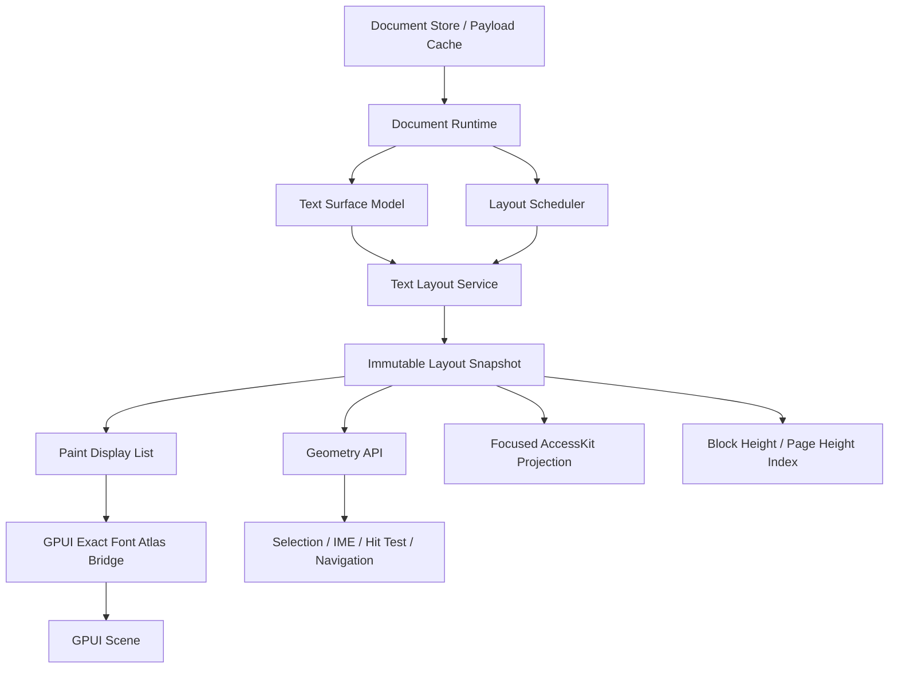

# Cditor Parley 文本系统目标架构与重构方案

> 状态：设计完成，待按阶段实施。
>
> 基线分支：`codex/parley-text-layout`
>
> 关联文档：`large-document-rich-text-architecture.md`、`parley-text-layout-migration.md`、
> `parley-0.11-capability-audit.md`

## 1. 设计结论

如果从零设计 Cditor，我仍会选择：

```text
GPUI = 应用壳、组件、事件、窗口、场景与平台接入
Parley = 文本分析、fallback、shaping、Bidi、换行、排版与文本几何
Cditor Runtime = 文档、事务、selection、IME、虚拟化与调度真相
```

但最终实现不应保持当前迁移期的形态。当前分支证明了 Parley 可以覆盖主 Block、table cell、
绘制和编辑几何；目标重构要进一步消除临时桥接、重复模型和隐式降级，把不可变 layout snapshot、
typed position、font instance、版本化缓存和调度预算变成系统的一等能力。

核心选择如下：

1. 不更换 GPUI，也不让 Parley `PlainEditor` 接管文档模型。
2. 每个文本 Block/cell 独立 layout，禁止全文 Parley `Layout`。
3. 一次 shaping 的 glyph id/position 同时服务 paint、caret、selection、IME 和 AccessKit。
4. 扩展 GPUI font/atlas API，原生表达 TTC face、variable coords 和 synthesis；family 猜测不能成为最终方案。
5. 当前编辑 Block 走同步实时 lane；viewport/overscan 走有预算任务；远端只保留高度和可丢弃缓存。
6. 超长 CodeBlock、大 cell、大段落必须支持 Block 内部行级虚拟化，不能靠提高全段 layout 上限。
7. 重构采用 strangler 迁移，每阶段有行为和性能门禁，不做一次性推倒重写。

## 2. 当前、迁移层与目标形态

| 维度 | 旧实现 | 当前 Parley 验证层 | 目标架构 |
|---|---|---|---|
| shaping | GPUI 为主，部分估算布局 | Parley 为主 | Parley layout service 唯一入口 |
| 绘制 | GPUI shaped line | Parley glyph 直送 GPUI atlas | 精确 `FontInstanceKey` 直送 atlas |
| 几何 | 多套 offset/line 计算 | Parley snapshot 优先 | 只允许 snapshot geometry |
| affinity | 多数路径丢失 | runtime、Block、cell 已贯通 | typed position 全链路强制携带 |
| table | 单独 GPUI shaping element | 复用 Parley element | cell text surface 与普通 Block 同协议 |
| 缓存 | 旧估算 layout cache | 线程局部 512-entry snapshot cache | 分层缓存、pin、字节预算、调度器 |
| 字体身份 | GPUI family 选择 | Parley face 映射 GPUI family | blob/face/coords/synthesis 精确身份 |
| Accessibility | 无文本 layout 投影 | focused layout 生成 TreeUpdate | GPUI 平台 adapter 正式提交 subtree |
| inline widget | 无正文 token | layout/painter 扩展点 | 模型、事务、剪贴板、协作完整协议 |
| 长 Block | 主要整 Block layout | 仍以整 Block 为主 | piece/paragraph/line 分层增量与虚拟化 |

## 3. 不变量

重构期间和完成后必须始终成立：

```text
DocumentStore / DocumentRuntime 是正文真相。
DocumentSelection 是选区真相，UI entity 不拥有 selection。
VirtualScrollState 是全局滚动真相，GPUI local scroll 只是投影。
LayoutSnapshot 可丢弃、可重建，不能反向修改正文。
同一帧 paint/caret/selection/IME 必须读取同一 snapshot id。
所有文本位置都是 UTF-8 byte offset + affinity；平台边界显式转 UTF-16。
当前 editing/composition Block 的 payload、layout 和 geometry 必须 pin。
过期的 content/layout/font/scale generation 结果绝不能覆盖当前结果。
```

禁止项：

```text
禁止 Parley 测量后由 GPUI 再 shape 正文。
禁止用平均字符宽度处理生产 hit-test 或 IME geometry。
禁止缓存 key 只包含 block_id + width。
禁止在输入帧同步扫系统字体、全段 syntax highlight、全页 layout 或持久化。
禁止把 font family 映射失败静默当作精确绘制。
禁止因为 AccessKit 支持文本节点而实体化全文节点。
```

## 4. 目标分层



### 4.1 Crate 职责

`cditor-core`：

- typed text offsets、affinity、document selection；
- inline content token、marks、Block attrs；
- layout key 中与业务模型有关的版本；
- 不依赖 GPUI、Parley 或平台字体。

`cditor-runtime`：

- text surface 生命周期、transaction、undo/redo、composition；
- layout request、generation、scheduler priority、pin；
- selection 跨 Block 解析和 projection；
- 只依赖抽象 layout contract，不依赖 GPUI element。

`cditor-text`（建议从 `app/gui/text` 独立）：

- Parley contexts、style adapter、layout builder；
- snapshot、geometry、paint display list、AccessKit projection；
- font database/version 和 exact font instance；
- 不依赖具体 Cditor view。

`cditor-desktop`：

- GPUI element、input adapter、overlay 和场景提交；
- 把 runtime request 交给 text service；
- 不再拥有独立文字换行或 selection 算法。

`gpui`/本地 patch crate：

- exact external font face 注册；
- font instance atlas key；
- monochrome/color glyph raster；
- AccessKit subtree update 入口。

### 4.2 建议目录

```text
crates/cditor-text/
  src/
    lib.rs
    context.rs
    request.rs
    key.rs
    style.rs
    layout.rs
    snapshot.rs
    geometry.rs
    display_list.rs
    font/
      database.rs
      instance.rs
      bridge.rs
      color.rs
    inline_box/
      model.rs
      registry.rs
    accessibility.rs
    cache/
      shaped.rs
      layout.rs
      policy.rs
    diagnostics.rs

crates/cditor-runtime/src/text/
  surface.rs
  composition.rs
  selection.rs
  request.rs
  scheduler.rs
  pin.rs

crates/cditor-editor-gpui/src/text/
  element.rs
  input_adapter.rs
  scene_bridge.rs
  accessibility_bridge.rs
```

任何单文件超过约 700 行时按上述职责继续拆分。

## 5. 核心类型

### 5.1 TextPosition

```rust
struct TextPosition {
    surface: TextSurfaceId,
    offset: TextByteOffset,
    affinity: TextAffinity,
}
```

`TextSurfaceId` 统一表示普通 Block 与 table cell：

```rust
enum TextSurfaceId {
    Block(BlockId),
    TableCell { block_id: BlockId, row: RowId, col: ColId },
    Ephemeral(EphemeralTextId),
}
```

要求：

- 不再用裸 `usize` 跨模块传递文本位置；
- grapheme、word、logical、visual movement 的结果都返回 `TextPosition`；
- UTF-16 只存在于 platform adapter；
- table 行列最终使用稳定 id，而不是仅用可重排的 index。

### 5.2 LayoutRequest 与 Key

```rust
struct TextLayoutRequest {
    surface: TextSurfaceId,
    text: Arc<str>,
    runs: Arc<[ResolvedStyleRun]>,
    inline_boxes: Arc<[InlineBoxInput]>,
    width: LayoutPx,
    scale: f32,
    alignment: TextAlignment,
    versions: LayoutVersions,
    priority: LayoutPriority,
}

struct LayoutVersions {
    content: u64,
    style: u64,
    block_layout: u64,
    theme_metrics: u64,
    font_collection: u64,
    font_fallback: u64,
    scale: u64,
    shaping_engine: u64,
}
```

拆成两个 key：

```text
ShapeKey  = text/runs/inline box structure/font/locale/features/scale/shaper versions
LayoutKey = ShapeKey + width/wrap/alignment/indent/inline box metrics
PaintKey  = LayoutKey + paint-only theme/selection/decoration generation
```

宽度或 alignment 单独变化时 clone Parley layout 后 `break_all_lines + align`；文本、style、font
环境变化才重新 shape。Inline box 的位置、kind 或原子 identity 属于 structure；仅 width/height/
baseline 变化时 clone layout、更新 `inline_boxes_mut()` 并重新断行，不重新 shape 正文。

### 5.3 Immutable LayoutSnapshot

```rust
struct TextLayoutSnapshot {
    id: LayoutSnapshotId,
    key: LayoutKey,
    text: Arc<str>,
    layout: Arc<ParleyLayout>,
    lines: Arc<[LineSnapshot]>,
    inline_boxes: Arc<[PositionedInlineBox]>,
    display_list: OnceCell<Arc<TextDisplayList>>,
    metrics: LayoutMetrics,
    diagnostics: LayoutDiagnostics,
}
```

Snapshot 发布后不可变。layout、geometry、paint、IME 和 accessibility 只接收 snapshot 引用，
不能各自按 text/width 临时重建。

## 6. 输入与编辑流水线

```text
key/composition event
  -> platform UTF-16 range 转 typed byte range
  -> runtime transaction 修改 piece table / inline runs
  -> 更新 DocumentSelection / CompositionState
  -> 创建 Realtime LayoutRequest
  -> UI 线程或 realtime worker 生成 current snapshot
  -> 原子发布 snapshot
  -> 同一 snapshot 更新 caret、candidate rect、height delta、paint
  -> persistence / FTS / highlight 后置
```

输入帧约束：

- selection/model update 目标 `< 0.2ms`；
- 当前小 Block layout 目标 p95 `< 4ms`；
- candidate rect 不等待普通 background queue；
- composition preview 不进入普通 undo；commit 是单独 undo boundary；
- snapshot 发布失败时保留上一个可绘制版本，但禁止用旧 geometry 回答当前 IME。

对超预算文本：先同步完成 caret 附近 paragraph/line neighborhood，再由后台补全；这要求长 Block
内部模型支持分段，而不是直接对一个 10MB 字符串构建完整 layout。

## 7. Selection、Hit-Test 与导航

统一接口：

```rust
trait TextGeometry {
    fn position_for_point(&self, point: LocalPoint) -> TextPosition;
    fn caret_rect(&self, position: TextPosition) -> LocalRect;
    fn selection_rects(&self, selection: SurfaceSelection) -> Arc<[LocalRect]>;
    fn move_position(&self, selection: SurfaceSelection, command: MoveCommand) -> SurfaceSelection;
    fn select_at_point(&self, point: LocalPoint, granularity: SelectionGranularity) -> SurfaceSelection;
}
```

规则：

- 左右键使用 visual cluster movement；Ctrl/Option word movement 明确区分 visual/logical；
- 上下键使用 Parley `move_lines`，并保留 desired inline coordinate；
- Home/End 默认 visual soft line，平台命令可选择 hard line；
- 同 Block drag 与 Shift-click 使用 Parley `extend_to_point` / `shift_click_extension`，保存
  anchor/focus 的 affinity；跨 Block 时由 runtime 拼接 document selection；
- 双击 word、三击 line/hard-line 直接用 Parley selection；
- 跨 Block selection 仍由 runtime normalize，Block 内矩形来自对应 snapshot；
- stale/missing snapshot 只允许高优先级重建或明确 emergency fallback，不能估算字符宽度。

## 8. IME 与平台文本协议

CompositionState 必须记录：

```text
surface id
base content version
before selection
replacement range
marked range
selected subrange
snapshot id used by candidate rect
```

要求：

1. replacement/marked range 在平台入口统一做 UTF-16 转换和 grapheme normalization。
2. marked text 的背景、下划线、caret 均来自 preview snapshot。
3. candidate rect 必须验证 snapshot content version 等于 composition preview version。
4. 当前 composition surface 永远 pin payload、text model、layout 和 entity。
5. table cell 与普通 Block 使用同一个 platform input adapter，仅 `TextSurfaceId` 不同。
6. cancel 精确恢复 before text/selection；commit 生成一个 transaction 和一个 undo group。

## 9. 字体与精确绘制

### 9.1 最终 FontInstanceKey

```rust
struct FontFaceKey {
    blob_id: FontBlobId,
    face_index: u32,
}

struct FontInstanceKey {
    face: FontFaceKey,
    normalized_coords: SmallVec<[i16; 8]>,
    size_bits: u32,
    synthesis: FontSynthesis,
    hinting: HintingMode,
    color_mode: ColorGlyphMode,
}
```

GPUI glyph atlas key 必须包含：

```text
FontInstanceKey + glyph id + scale + subpixel variant + raster mode
```

最终桥接步骤：

```text
Parley run.font/data/index/coords/synthesis
  -> register_exact_face(blob, face_index)
  -> resolve FontInstanceKey
  -> GPUI raster_bounds/rasterize_glyph(instance, glyph_id)
  -> atlas + scene primitive
```

不能把 Parley 选出的 face 重新降成 family/weight/style 后让平台二次选 face，因为 glyph id 只对原 face
有意义。

### 9.2 Color 与 variable font

- COLR/CPAL、CBDT/CBLC、sbix 和 SVG glyph 按实际 glyph id 决定 raster path；
- variable coords 必须进入 scaler location 和 atlas key；
- faux bold/skew 必须由 scaler outline transform 表达；
- TTC/OTC 使用真实 face index；
- glyph raster 失败记录 face/glyph/instance，但日志不得包含正文内容。

### 9.3 推荐实施

首选扩展 GPUI `PlatformTextSystem` 和 `RenderGlyphParams`，让 macOS/Windows/WGPU 后端共享
`FontInstanceKey`。若短期无法修改 GPUI，则增加 Skrifa raster bridge，但仍写入 GPUI atlas；不得回退为
GPUI 重新 shape 文本。

## 10. 样式、装饰与高级 Typography

将属性分为：

```text
shape-affecting: family/face/size/width/weight/slant/variation/features/locale/letter spacing
line-affecting: line height/word spacing/wrap/word break/overflow/white-space/line-break policy/
                indent/alignment/alignment overflow/inline box metrics
paint-only: foreground/background/underline/strike/selection/search/comment/collab cursor
```

paint-only 变化不应重新 shape。`ResolvedStyleRun` 完整承载 Parley `TextStyle`，payload 演进需要支持：

- font family/size/width/weight/slant；
- OpenType features 和 variable axes 白名单；
- locale 与语言自动检测覆盖；
- word/letter spacing；
- word-break、overflow-wrap、text-wrap；
- white-space collapse/preserve 与版本化 line-break override；
- alignment overflow policy；
- underline/strike style、offset、thickness、brush；
- semantic link、comment、mention metadata 与视觉样式分离。

## 11. Inline Widget

正文模型新增原子 token，而不是用不可见占位字符猜位置：

```rust
enum InlineContent {
    Text(InlineSpan),
    Widget(InlineWidgetToken),
}

struct InlineWidgetToken {
    id: InlineWidgetId,
    renderer: RendererKey,
    payload: VersionedJson,
    fallback_text: String,
    baseline: BaselinePolicy,
    accessibility_label: Option<String>,
}
```

完整协议必须包含：

- Parley inline box 尺寸与 baseline；
- GPUI renderer registry；
- selection 前后位置与原子删除；
- clipboard HTML/plain/internal envelope；
- undo/redo、持久化和未来协作 id；
- async widget 的 stable box 与尺寸变更 generation；
- structure 与 metrics 分 key，异步尺寸变化只 re-linebreak；
- renderer 缺失时显示 fallback text，不丢正文。

`InFlow` 是正文 widget 的默认模式。`CustomOutOfFlow` 只有在调用方实现 `BreakLines` yield、
placement、revert 和避让算法后才允许使用；不能把当前 `break_all_lines` adapter 视为已支持 float。

## 12. Table 文本

table cell 不再是特殊文字引擎，只是不同的 `TextSurfaceId` 和容器约束：

```text
Table layout 决定 cell bounds/padding/alignment
Text layout service 决定 cell 内 shaping/wrap/geometry/paint
Runtime 决定 cell selection/composition/transaction
```

还需做到：

- cell 使用稳定 RowId/ColId，reorder 后 caret 不漂移；
- cell key 包含 cell content/style version、column width、header typography；
- merged cell 只为 origin 建 text surface；
- 5w 行 table 外层 stable box + 内部行虚拟化；
- table resize 期间 width preview 走 reflow，commit 后发布正式 key；
- 大 cell 文本使用 paragraph/line 增量策略。

## 13. 缓存、内存与 Pin

缓存层级：

```text
Font database/cache          进程级，版本化
Shaped content cache         worker/thread context，按 ShapeKey
Layout snapshot cache        UI/runtime 可见窗口，按 LayoutKey
Paint display list cache     snapshot 内 lazy
Geometry fragments cache     editing/selection endpoint pin
Historical height cache      全文轻量持久化
```

策略：

- entry 数和估算字节双预算；
- editing/composition/selection endpoints 不参加普通 LRU；
- viewport exact、overscan warm、远端 historical 分级；
- memory warning 先清 decoded media/paint list，再清 offscreen layout，最后清 shaped cache；
- 永不清 dirty payload、composition state、save-failed data；
- width resize 高频期间只保留最近 N 个 width key；
- font/theme/scale generation 变化时旧 snapshot 降为 historical，不能回答当前 geometry。

初始预算建议：

```text
layout snapshots: 512 entries 或 32 MiB，先到者为准
editing pinned snapshots: 每 surface 最近 2 个 generation
paint display lists: viewport + 1 屏 overscan
worker shape queue: interactive 64 / viewport 256 / background 512
```

这些值必须由 telemetry 调整，不能写死后不观测。

## 14. 调度与并发

优先级：

```text
Composition > EditingCaret > SelectionEndpoint > Viewport > Overscan > Prefetch > HistoricalRepair
```

每个任务携带：

```text
surface id + request generation + LayoutKey + priority + cancel token
```

线程规则：

- 每个 worker 有独立 Parley `FontContext/LayoutContext`，不共享热路径锁；
- font collection 变更通过 immutable database snapshot/version 广播；
- UI 线程只提交小 Block realtime layout 和应用完成结果；
- background result 在 frame budget 内限量 apply；
- 同 surface 新 generation 到来立即取消/丢弃旧任务；
- 低优先级队列不得占满所有 worker，至少保留一个 interactive lane。

## 15. Accessibility

- 只投影 focused Block、selection endpoints 和 viewport 附近语义上下文；
- Parley `LayoutAccessibility` 生成 TextRun、character lengths/positions/widths、word starts；
- pinned/focused surface 保留 `LayoutAccessibility`，跨 update 复用稳定 span id；
- parent node 暴露 text selection 和 `SetTextSelection`；
- AccessKit action 反向转换为 typed `TextPosition` 后进入 runtime transaction；
- node id 由 document/surface/token 稳定派生，不能按每帧递增；
- table 还需 row/column/header 语义，cell 的文本 subtree 挂到 cell node；
- 虚拟窗口变化使用 subtree diff，不提交全文 TreeUpdate。

## 16. 故障与降级

允许的降级：

- layout cache miss：按优先级重建；
- 后台超预算：保留 stable height/旧 paint，当前 geometry 请求升级 realtime；
- inline renderer 缺失：使用持久化 fallback text；
- AccessKit 平台桥不可用：编辑功能正常，记录 capability；
- color glyph 特定格式不支持：使用同 face 的 monochrome outline（存在时）并计数。

不允许的降级：

- glyph face 不匹配后重新 shape 一段文本；
- current IME 使用旧 snapshot rect；
- invalid byte/UTF-16 offset 静默落在 code point 中间；
- 文字完全不画但只返回 `Ok`；
- 字体 instance 不精确却标记为 exact layout/paint。

建议诊断：

```text
layout_cache_hit / reflow_hit / reshape
layout_ms by priority and block kind
shape_count / glyph_count / line_count
stale_result_discard
font_face_registration_error
font_instance_inexact
glyph_raster_error by format
IME snapshot mismatch
accessibility_nodes_projected
inline_box_missing_renderer
```

## 17. 性能门禁

沿用总体架构并增加文本专项指标：

```text
typing p50 < 4ms, p95 < 8ms, p99 < 16ms
small editing Block layout p95 < 4ms
IME update -> matching candidate rect p95 < 8ms
cached Block paint-list build p95 < 1ms
viewport text apply per frame < 4ms
wheel frame main-thread p95 < 8ms
layout cache hit + reflow hit >= 90% during steady scroll/resize
glyph/font registration errors = 0 in supported corpus
caret viewport drift <= 1 device px
```

基准语料必须包含 ASCII、CJK、combining、ZWJ emoji、Arabic、Hebrew、mixed Bidi、Indic、Thai、
variable font、TTC、COLR v0/v1、bitmap emoji、长 code、长单段、密集 table 和 inline widgets。

## 18. 测试体系

### 18.1 单元测试

- typed offset 与 UTF-8/UTF-16/grapheme normalization；
- StyleRun 完整覆盖、不重叠；
- ShapeKey/LayoutKey/PaintKey 每个字段的失效；
- CJK/emoji/combining/complex scripts cluster；
- mixed Bidi visual movement 和 affinity；
- soft/hard line、word、vertical desired-x；
- inline box baseline/hit/delete/clipboard；
- exact font face/index/coords/synthesis atlas key；
- color glyph format routing；
- AccessKit position/selection roundtrip；
- stale generation discard 和 LRU/pin。

### 18.2 集成测试

- 实际 GPUI element request-layout/prepaint/paint/cache；
- Block 与 table cell 同 corpus 像素/geometry 对比；
- IME marked preview、candidate rect、commit/cancel/undo；
- resize 只 reflow、font change reshape；
- slash/AI/toolbar/comment/search overlay 使用同 snapshot；
- table resize/reorder/merge 后 selection 稳定；
- Accessibility focused subtree action roundtrip。

### 18.3 视觉与压力测试

- desktop/mobile 不适用；需 macOS/Windows/Linux DPI 1x/1.25x/2x screenshot golden；
- 100k mixed Block 连续滚动；
- 10MB code、5w row table、超长 RTL paragraph；
- 字体热插拔、主题/zoom/scale 连续变化；
- 10 分钟 typing + IME + scroll soak；
- glyph raster/font fallback 故障注入。

## 19. 分阶段重构计划

每完成一项立即勾选；未通过阶段 gate 不进入下一阶段。

### Phase 0：冻结基线与观测

- [ ] 把当前 Parley 验证层作为行为基线，保存 CJK/Bidi/emoji/table/IME screenshots。
- [ ] 增加 layout/cache/font/glyph/IME telemetry 与 debug overlay。
- [ ] 建立 typing、scroll、resize、large Block benchmark corpus。
- [ ] 记录旧实现与当前验证层 p50/p95/p99、内存和 shape count。
- [x] 完成 Parley 0.11 feature/public API/生产调用点能力审计。

Gate：行为 corpus 可重复，性能数据可比较，现有测试全绿。

### Phase 1：类型与协议

- [ ] 引入 `TextSurfaceId`、`TextByteOffset`、强制 affinity 的 `TextPosition`。
- [ ] 引入 `LayoutVersions`、`ShapeKey/LayoutKey/PaintKey`。
- [ ] 定义不可变 `TextLayoutSnapshot` 和唯一 `TextGeometry` API。
- [ ] runtime/app 禁止新增裸 offset 和临时 layout 几何。
- [ ] 普通 Block 与 table cell selection/composition 收敛到同协议。

Gate：编译期阻止无 affinity position；所有 geometry consumer 只收 snapshot。

### Phase 2：独立 Text Layout Service

- [ ] 新建 `cditor-text` crate 并移动 Parley context/style/layout/snapshot/geometry。
- [ ] 建立分层有界缓存与 editing pin。
- [ ] 接入 LayoutScheduler generation/cancel/priority。
- [ ] width/alignment reflow 与 reshape 指标可验证。
- [ ] 删除 app 内旧估算 layout 对生产路径的影响。

Gate：主 Block/table/overlay 全走 service；稳定滚动无无界 shape 增长。

### Phase 3：Exact Font Instance 与 Atlas

- [x] 定义 `FontFaceKey/FontInstanceKey`。
- [ ] 建立 custom font 注册、generic family 与 script/locale fallback policy/generation。
- [ ] 扩展 GPUI `PlatformTextSystem` 注册 blob + face index。
- [x] exact raster/image-atlas key 接入 blob/face、normalized coords、synthesis、color mode、subpixel 和 policy version。
- [x] GPUI 原生 glyph atlas 无法表达完整 instance 时，直接从 Parley 原始字体实例栅格并进入 image sprite atlas。
- [ ] 实现 COLR/bitmap/SVG/monochrome glyph 路由。
  - 当前：COLR/bitmap/monochrome 已接入；SVG 已按实际 glyph id 识别并显式失败，仍缺 OT-SVG renderer。
- [x] 移除 family heuristic 作为正常路径。
- [x] unsupported font corpus 必须显式失败或精确降级。

Gate：TTC、variable、faux style、emoji corpus glyph id/face/像素验证通过。

### Phase 4：Editing、IME 与 Geometry 收口

- [ ] 所有鼠标命中、拖选、word/line selection 走 `TextGeometry`。
- [ ] 左右/上下/Home/End 与 desired-x 全走 Parley selection。
- [ ] word movement、Shift-click、同 Block drag extension 全走 Parley selection。
- [ ] composition preview 和 candidate rect 校验 snapshot id/version。
- [ ] 删除旧 platform line geometry 和估算 fallback。
- [ ] 跨 Block selection endpoint pin 与 auto-scroll 压测。

Gate：CJK/emoji/Bidi/IME corpus 无 caret drift，候选框版本一致。

### Phase 5：Table 与 Inline Widget

- [ ] table row/column 稳定 id 进入 `TextSurfaceId`。
- [ ] cell layout key、resize reflow、merge/reorder selection 完整接入。
- [ ] 引入 `InlineContent/InlineWidgetToken` 持久化模型。
- [ ] inline box structure/metrics/paint 分 key，尺寸变化只 reflow。
- [ ] renderer registry、clipboard、undo、fallback、AccessKit 完整实现。
- [ ] 5w row table 与大 cell 内部虚拟化。

Gate：table 与普通 Block 共用同一文本测试套件；widget 缺 renderer 不丢数据。

### Phase 6：Accessibility 平台桥

- [ ] GPUI 暴露 AccessKit root/subtree update 与 action handler。
- [ ] focused Block/cell TreeUpdate 正式提交平台。
- [ ] selection action roundtrip 到 runtime。
- [ ] pinned/focused surface 保留 `LayoutAccessibility` stable span-id state。
- [ ] table semantics 和 inline widget label/action。
- [ ] 虚拟窗口 subtree diff 与 node id 稳定性测试。

Gate：VoiceOver/NVDA 可读写 focused 文本，100k Block 不创建全文 nodes。

### Phase 7：长 Block 与并发硬化

- [ ] piece/paragraph/line dirty range 增量 shaping。
- [ ] CodeBlock 行级虚拟化、syntax highlight 与 layout 分离。
- [ ] 超长 paragraph neighborhood layout。
- [ ] worker lane 隔离、backpressure、memory warning policy。
- [ ] stale/cancel/resize/font-change chaos tests。

Gate：10MB code 和超长段落 typing p95 达标，后台任务不抢占 input lane。

### Phase 8：删除迁移层并发布

- [ ] 删除旧 `RichTextLayout` 估算生产接口和 GPUI shaped text 正文路径。
- [ ] 删除重复 Block/table text element 与 compatibility fields。
- [ ] 更新架构文档、API 文档、升级说明和诊断手册。
- [ ] 完整 workspace test/check、跨平台视觉测试、soak 和性能门禁。
- [ ] 灰度开关仅用于新旧 service 切换，不允许同帧混用两套 geometry。

Gate：所有不变量自动验证，旧路径无调用点，性能无回退后合并。

## 20. 首批可直接推进任务

建议按以下顺序开始，不先动 GPUI 大接口：

- [ ] R1：在 `cditor-core` 定义 `TextSurfaceId/TextByteOffset/TextPosition`，写转换测试。
- [ ] R2：定义 `LayoutVersions/ShapeKey/LayoutKey/PaintKey`，替换当前临时 key。
- [ ] R3：定义 `TextLayoutSnapshot/TextGeometry` contract，给当前 Parley snapshot 实现。
- [ ] R4：把 app 的 Block/table/IME/overlay consumer 改为只依赖 contract。
- [ ] R5：建立 telemetry 和 benchmark，冻结当前分支数据。
- [ ] R6：创建 `cditor-text` crate，机械迁移已验证模块，不改变行为。
- [ ] R7：单独设计并实现 GPUI `FontInstanceKey` RFC/patch。
- [ ] R8：接入 custom font/fallback policy、line policy、ContentWidths 和完整 Selection API。

R1-R6 完成且测试无回退后，再进入 exact font atlas 改造。这样先把边界收紧，再替换底层绘制，
出问题时可准确判断是模型、layout、font 还是 scene bridge。
